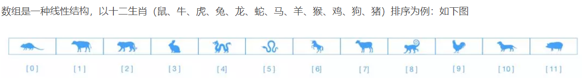
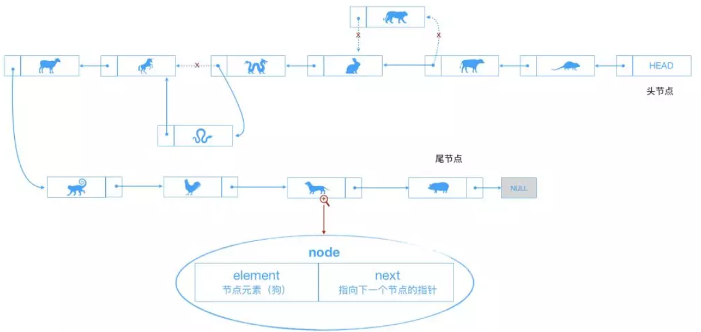
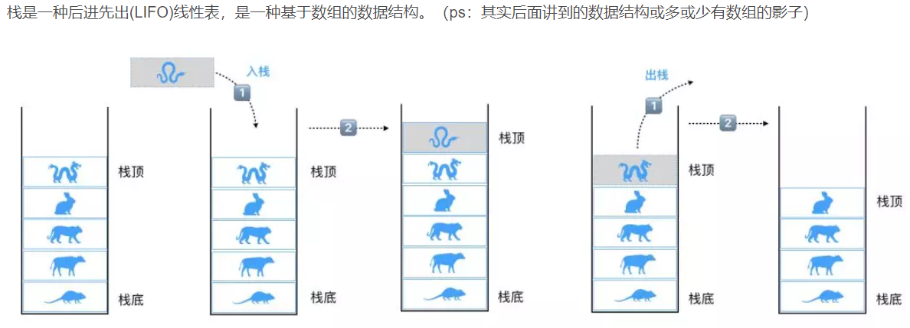
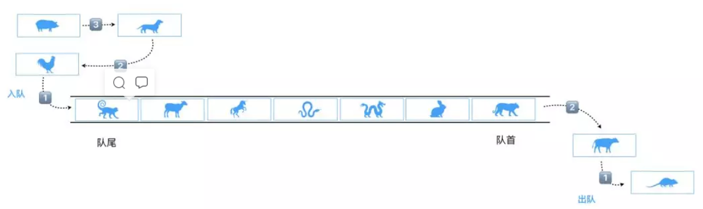

# 数据结构

## 数组

```
数组有连续的内存空间和相同类型的数据。正是有了这两个限制，才有了一个堪称杀手锏的特性：“随机访问”，但是删除和插入一个数据，为了保证连续性，就需要做大量的数据搬移工作。
```



### 优点：

```java
查询效率高
```

### 缺点：

```java
增加和删除效率低
```

## 链表

```javascript
链表是由一组节点组成的集合。每个节点都使用一个对象的引用指向它的后继。
```



### 优点：

```java
增加和删除效率高
```

### 缺点：

```java
查询效率低
```

## 栈(先进后出 后进先出)

```javascript
1、LIFO(Last In First Out)表示后进先出，后进来的元素第一个弹出栈空间。类似于自动餐托盘，最后放上去的托盘，往往先被拿出来使用。
2、仅允许在表的一端进行插入和移除元素。这一端被称为栈顶，相对地，把另一端称为栈底。如上图的标识。
3、向一个栈插入新元素称作进栈、入栈或压栈，这是将新元素放在栈顶元素上面，使之成为新的栈顶元素。
4、从一个栈删除元素又称为出栈或退栈，它是把栈顶元素删除掉，使其相邻的元素成为新的栈顶元素。
```



## 队列(先进先出 后进后出)

```javascript
队列可以用数组实现，也可以用链表实现，用数组实现时是顺序存储，用链表实现时是链式存储。

队列是一种先进先出（FIFO）受限的线性表。受限体现在于其允许在表的前端（front）进行删除操作，在表的末尾（rear）进行插入【优先队列这些排除在外】操作。（即数据在尾部进入，在头部拿出）
```



## hash表

```javascript
将目标值（关键值，即一组数据中比较关键的值，通常具有唯一性，比如用户id）通过一个函数映射成存储地址，这个映射函数称为Hash函数，存放记录的数组称为Hash表
```

### 如何解决hash冲突？

```
理想情况下，哈希函数会保证每一个地址对应唯一的一个值。但是实际情况下不太可能，于是就可能会产生冲突
1.构造hash函数   常用 除留余数法 一般除数为质数 减少了冲突的次数
2.解决冲突  链地址法 
```

### 链地址法

```javascript
将所有按给定的hash函数求得的hash地址相同的关键字存储在同一线性链表中 且使链表按关键字有序排列。
```

## 树

```javascript
n(n >= 0)个节点构成的有限集合
1、当`n = 0`时，称为空树。
2、对任意一棵非空树`(n > 0)`，它具备以下性质：
3、树中有一个称为根(Root)的特殊节点，用`r(root)`表示；
4、其余节点可分为`m(m > 0)`个互不相交的有限集`T1,T2,…Tm`，其中每个集合本身又是一棵树，称为原来树的子树（SubTree）
注意：
1、子树之间`不可以相交`；
2、除了根节点外，每个节点有且仅有一个父节点；
3、一个`N`个节点的树有`N-1`条边。
```

## 常见的树

### 红黑树

```

```

## 排序算法

[十大经典算法总结 - 不可满 - 博客园 (cnblogs.com)](https://www.cnblogs.com/herozhi/p/5880939.html) 

# 算法

## 冒泡排序

### 算法描述

```javascript
1.比较相邻的元素
2.每一轮会找出一个数的位置(最大的或者最小的) 重复n-1轮
3.冒泡排序是一种稳定的算法
```

### 代码实现

```java
//N个数字冒泡排序，总共要进行N-1趟比较，每趟的排序次数为(N-i)次比较  从小到大排序
    public static void bubbleSort(int[] arr){
        //一定要记住判断边界条件，很多人不注意这些细节，面试官看到你的代码的时候都懒得往下看，你的代码哪个项目敢往里面加？
        if(arr==null||arr.length<2){
            return;
        }
        //需要进行arr.length趟比较
        for(int i = 0 ;i<arr.length-1;i++){
            //第i趟比较  i为序列正确的数字个数  故要减掉  不减掉可会影响效率
            for(int j = 0 ;j<arr.length-i-1;j++){
                //开始进行比较，如果arr[j]比arr[j+1]的值大，那就交换位置
                if(arr[j]>arr[j+1]){
                    int temp=arr[j];
                    arr[j]=arr[j+1];
                    arr[j+1]=temp;
                }
            }

        }
//        System.out.println("最终得出的数组为：");
//        for (int k =0 ; k < arr.length;k++){
//            System.out.print(arr[k]+" ");
//        }
    }
```

## 选择排序

```java
// 选择排序原理是先将数组中最小的元素找到并且标记，即记录最小数据的下标，将找到的最小元素移动到最左侧，
    // 也就是目前的下标最小的位置，下次比较就除去上次找到并且移动的最小值，对剩下数据继续重复上述操作，直到排序结束。
    // 选择排序其实可以算是对冒泡排序的一个优化，
    // 区别就是冒泡排序每次比较完将大小不对数据进行交换，选择排序跟冒泡的对比时间复杂度是一样的，只是每次内循环都将数据最小的角标标记，然后再交换数据，所以选择排序的数据交换时间复杂度是低于冒泡排序的
    /**
     * 如果待排序的数组大小数量大于 10000 则使用选择排序  原则上使用选择排序  换值改为换下标 在面对海量数据时效率大大提升
     */
    private static void chooseSort(int[] datas) {
        //一定要记住判断边界条件，很多人不注意这些细节，面试官看到你的代码的时候都懒得往下看，你的代码哪个项目敢往里面加？
        if(datas==null||datas.length<2){
            return;
        }
        // 最小下标
        int minIndex;
        // 临时交换值
        int temp;
        for (int i = 0; i < datas.length - 1; i++) {
            // 假定下标为i的是最小下标
            minIndex = i;
            for (int j = i + 1; j < datas.length; j++) {
                if (datas[j] < datas[minIndex]) {
                    // 找到比 i下标对应值 更小的 下标
                    minIndex = j;
                }
            }
            // 判断i是否为最小下标  如果是 则 i下标对应的值最下  如果否 则交换值
            if (minIndex != i) {
                temp = datas[minIndex];
                datas[minIndex] = datas[i];
                datas[i] = temp;
            }
        }
//        System.out.println("最终得出的数组为：");
//        for (int k =0 ; k < datas.length;k++){
//            System.out.print(datas[k]+" ");
//        }
    }
```


## 递归

### 什么是递归?

```
递归函数是直接或者间接的调用自身
```

### 需满足的条件

```javascript
1.有反复的执行过程(调用自身)
2.有跳出反复执行过程的条件(递归出口)
```

### 递归的应用场景和优缺点

```
优缺点：
优点： 1. 解决重复执行任务 2. 处理不定层级数据
缺点： 1. 时间 空间的消耗较大 2. 重复计算 3. 栈溢出
使用场景：树形菜单，递归组件，快速排序等
```


### 示例

```java
1.阶乘  计算n!
可以算 5000以内的阶乘  (简单)
public static BigDecimal fac(BigDecimal n){
    BigDecimal one = new BigDecimal(1);
    if (n.equals(one)){
        return one;
    }
    return n.multiply(fac(n.subtract(one)));
}

计算10000以上的阶乘怎么办?

2.斐波那契数列
兔子总数分别为 1、1、2、3、5、8、13.....
public static int fid(int n){
	if(n<2){
		return 1;
	}
	return fid(n-1) + fid(n+1);
}
```

### 递归代码

```java
public List<FoodTypeResultPo> getColumnTree(DefaultQueryFilter queryFilter) {
		// 全查
		List<FoodTypeResultPo> allColumns = (List<FoodTypeResultPo>) getAll(queryFilter);
		// 获取到最上面目录那一列 最大目录的id等
		List<FoodTypeResultPo> rootColumns = allColumns.stream().filter(column -> {
			// 返回所有一级目录
			return column.getLevel() != null && column.getLevel() == 1;
		}).collect(Collectors.toList());
		// 递归 找出所有子节点
		rootColumns.forEach(column->{
			column.setChildrenList(getChildrenColumns(column,allColumns));
		});
		return rootColumns;
	}

	// 递归调用   获取所有的子节点
	private List<FoodTypeResultPo> getChildrenColumns(FoodTypeResultPo parent,List<FoodTypeResultPo> allColumns){
		List<FoodTypeResultPo> childrenColumns = allColumns.stream().filter(column->
				column.getParentid() !=null && column.getParentid().equals(parent.getId())).collect(Collectors.toList());
		if(CollectionUtil.isNotEmpty(childrenColumns)){
			childrenColumns.forEach(column->{
				column.setChildrenList(getChildrenColumns(column,allColumns));
			});
		}
		return childrenColumns;
	}
```

## 快速排序

参考博客  https://blog.csdn.net/qq_40941722/article/details/94396010

### 算法描述

```java
选择一个基准数，通过一趟排序来确定这个基准数的正确位置，这时这个基准数的两边还是乱的，分别对两边进行递归即可
```

### 代码实现

```java
// 1. 对左右两个哨兵分别赋值  
// 2. 从基准位置开始赋值  否则会出现改变原序列
static int[] quicksort(int low, int high, int num[]){
        if (low < high){
            int i,j,x;
            i = low;
            j = high;
            x = num[i];
            while (i < j){
                // 注意 因为选择的是第一个数为基准  故 第一个位置的数是可变的 一般选那个位置做基准就从那个位置开始赋值
                // 右边的
                while (i < j && num[j] >= x){
                    j--;
                }
                if (i < j){
                    //
                    num[i] = num[j];
                }
                // 左边的
                while (i < j && num[i] <= x){
                    i ++;
                }
                if (i < j){
                    // 找到做左边的数比基准值大的
                    num[j] = num[i];
                }
            }
            num[i] = x;
            quicksort(i + 1,high,num);  // 递归调用
            quicksort(low,i - 1,num);   // d
        }
        return num;
    }
```

