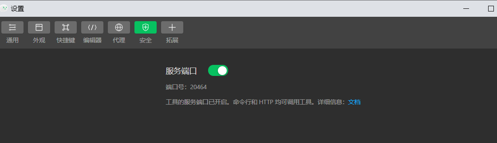

### 学习地址

```xml
https://www.bilibili.com/video/BV1BJ411W7pX?p=2&spm_id_from=pageDriver
```

### 环境准备

```
1.HbuilderX
2.微信开发者工具
```

### 运行配置

```js
1.运行到浏览器 直接运行
2.运行到微信开发者工具:
	配置HBuilderX微信开发者工具的根路径
	开启微信开发者工具的服务端口
3.运行到安卓手机 直接配置路径即可
```



### 目录讲解

```js
pages : 存放页面
static: 静态资源
unpackage : 存放最终打包输出的文件
App.vue :根组件
```


