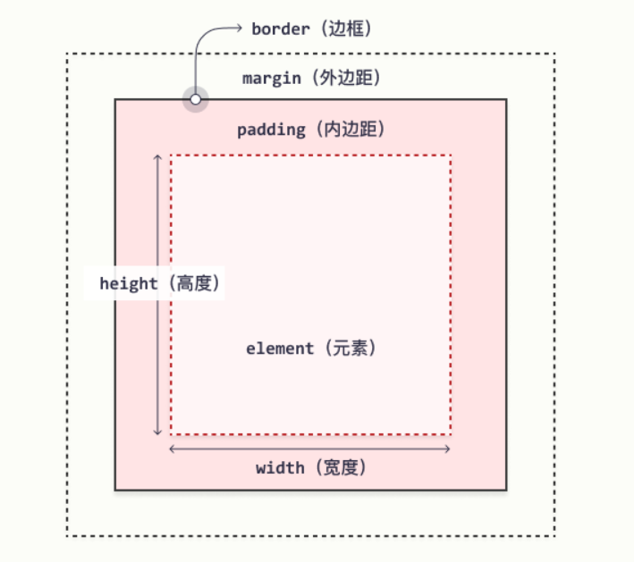

<h1 align="center">1.选择器</h1>

### 1.1 id 选择器  

这条 CSS 规则将应用于 id="para1" 的 HTML 元素：

```css
#para1 {
  text-align: center;
  color: red;
}
```

### 1.2 类选择器

在此例中，所有带有 class="center" 的 HTML 元素将为红色且居中对齐：

```css
.center {
  text-align: center;
  color: red;
}
```

### 1.3 通用选择器 

通用选择器（*）选择页面上的所有的 HTML 元素

下面的 CSS 规则会影响页面上的每个 HTML 元素：

```css
* {
  text-align: center;
  color: blue;
}
```

### 1.4 分组选择器 

如果对相同的html元素有相同的css样式代码，则可以对选择器进行分组，请用逗号来分隔每个选择器。

在这个例子中，我们对上述代码中的选择器进行分组：

```css
h1, h2, p {
  text-align: center;
  color: red;
}
```


1.5 后代选择器

对所有子元素都使用这一css规则

参考 https://www.w3school.com.cn/css/css_selector_descendant.asp

```css
.El-row-Input-width .el-input {
    width: 200px; 
}
// El-row-Input-width 下的 所有 el-input 的宽度变为 200px
```


<h1 align="center">2.盒子模型（框模型）</h1>




元素框的最内部分是实际的内容，直接包围内容的是内边距。内边距呈现了元素的背景。内边距的边缘是边框。边框以外是外边距，外边距默认是透明的，因此不会遮挡其后的任何元素。

### 2.1 元素的宽度和高度

<div style="color: #ff9933">使用 CSS 设置元素的 width 和 height 属性时，只需设置内容区域的宽度和高度。要计算元素的完整大小，还必须把内边距、边框和外边距加起来.</div>

div 元素的总宽度将是 350px：

```html
div {
  width: 320px;
  padding: 10px;
  border: 5px solid gray;
  margin: 0; 
}
```

计算如下

```shell
320px(宽度)
+ 20px（左+右内边距）
+ 10px（左+右边框）
+ 0px（左+右外边距）
= 350px
```

```shell
元素的总宽度应该这样计算：

元素总宽度 = 宽度 + 左内边距 + 右内边距 + 左边框 + 右边框 + 左外边距 + 右外边距

元素的总高度应该这样计算：

元素总高度 = 高度 + 上内边距 + 下内边距 + 上边框 + 下边框 + 上外边距 + 下外边距
```

<h1 align="center">3.定位position</h1>

参考 https://www.w3school.com.cn/css/css_positioning.asp

### 3.1 position属性

position 属性规定应用于元素的定位方法的类型。

有五个不同的位置值：

- static
- relative
- fixed
- absolute
- sticky

<div style="color: #ff9933">元素其实是使用 top、bottom、left 和 right 属性定位的。但是，除非首先设置了 position 属性，否则这些属性将不起作用。根据不同的 position 值，它们的工作方式也不同。</div>

### 3.2 position: absolute;

position: absolute; 的元素相对于最近的定位祖先元素进行定位（而不是相对于视口定位，如 fixed）。

然而，如果绝对定位的元素没有祖先，它将使用文档主体（body），并随页面滚动一起移动。

**注意：**“被定位的”元素是其位置除 **static** 以外的任何元素。

### 3.3 position: static;

静态定位的元素不受 top、bottom、left 和 right 属性的影响。

### 3.4 position: relative;

position: relative; 的元素相对于其正常位置进行定位。

设置相对定位的元素的 top、right、bottom 和 left 属性将导致其偏离其正常位置进行调整。不会对其余内容进行调整来适应元素留下的任何空间

### 3.5 position: absolute;

position: absolute; 的元素相对于最近的定位祖先元素进行定位（而不是相对于视口定位，如 fixed）。

然而，如果绝对定位的元素没有祖先，它将使用文档主体（body），并随页面滚动一起移动。

<div style="color: #ff9933">注意：“被定位的”元素是其位置除 static 以外的任何元素。</div>


### 3.6 重叠元素

z-index 属性指定元素的堆栈顺序（哪个元素应放置在其他元素的前面或后面）。

所有css定位属性

| 属性                                                         | 描述                         |
| :----------------------------------------------------------- | :--------------------------- |
| [bottom](https://www.w3school.com.cn/cssref/pr_pos_bottom.asp) | 设置定位框的底部外边距边缘。 |
| [clip](https://www.w3school.com.cn/cssref/pr_pos_clip.asp)   | 剪裁绝对定位的元素。         |
| [left](https://www.w3school.com.cn/cssref/pr_pos_left.asp)   | 设置定位框的左侧外边距边缘。 |
| [position](https://www.w3school.com.cn/cssref/pr_class_position.asp) | 规定元素的定位类型。         |
| [right](https://www.w3school.com.cn/cssref/pr_pos_right.asp) | 设置定位框的右侧外边距边缘。 |
| [top](https://www.w3school.com.cn/cssref/pr_pos_top.asp)     | 设置定位框的顶部外边距边缘。 |
| [z-index](https://www.w3school.com.cn/cssref/pr_pos_z-index.asp) | 设置元素的堆叠顺序。         |


<h1 align="center">浮动 Float</h1>


### float 属性

float 属性可以设置以下值之一：

- left - 元素浮动到其容器的左侧

- right - 元素浮动在其容器的右侧

- none - 元素不会浮动（将显示在文本中刚出现的位置）。默认值。

- inherit - 元素继承其父级的 float 值

  

<h1 align="center">溢出 overflow</h1>

overflow 属性可设置以下值：

- visible - 默认。溢出没有被剪裁。内容在元素框外渲染
- hidden - 溢出被剪裁，其余内容将不可见
- scroll - 溢出被剪裁，同时添加滚动条以查看其余内容
- auto - 与 scroll 类似，但仅在必要时添加滚动条

<div style="color: #ff9933">注释：overflow 属性仅适用于具有指定高度的块元素。</div>

<div style="color: #ff9933">注释：在 OS X Lion（在 Mac 上）中，滚动条默认情况下是隐藏的，并且仅在使用时显示（即使设置了 "overflow:scroll"）</div>

