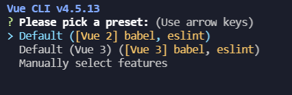
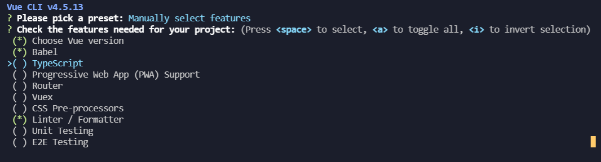
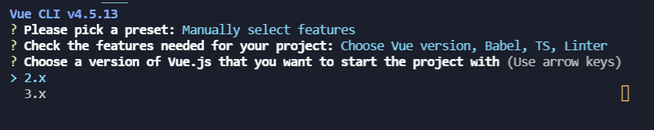
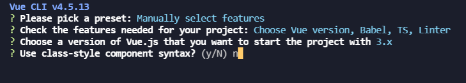
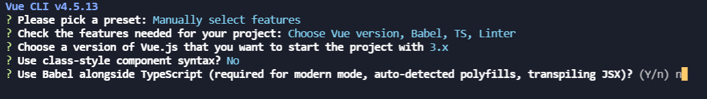
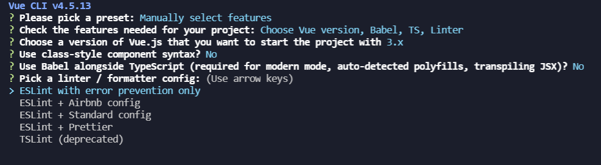
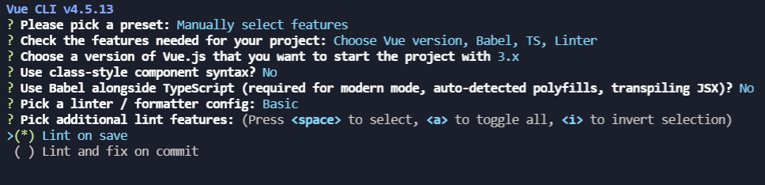
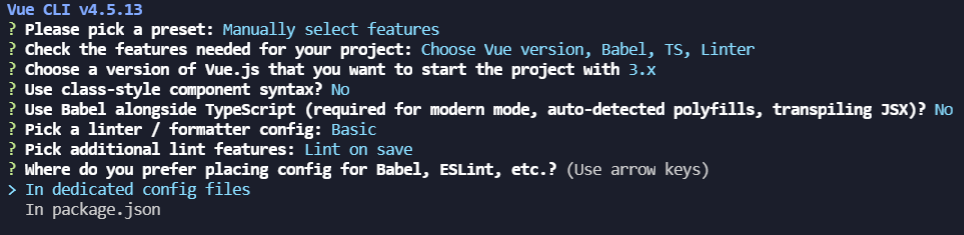
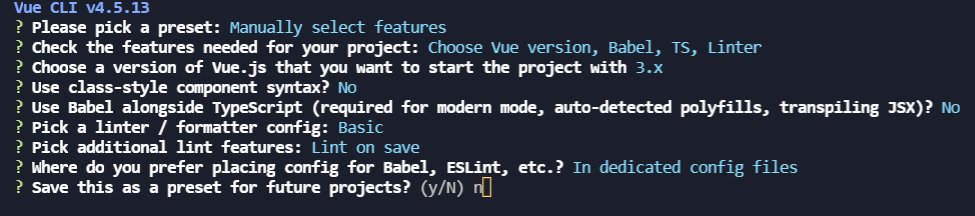
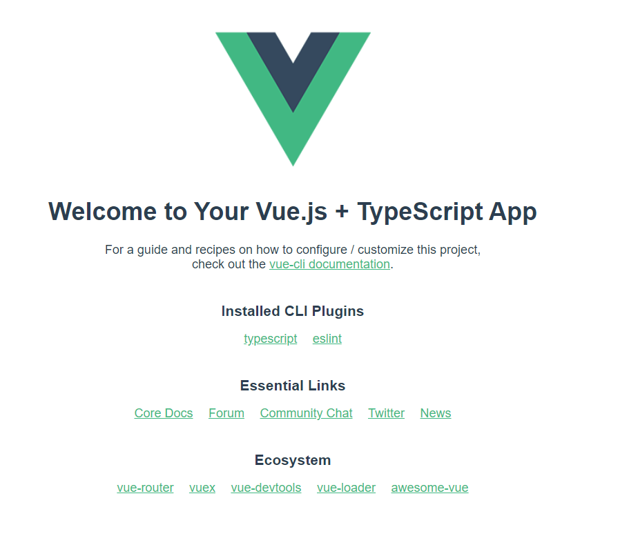

```javascript
// vue3开发环境的搭建
// 安装vue cli 确保 版本号高于 3.5.6
npm install -g @vue/cli
// 切换到项目文件夹 create 后接项目名称
vue create vue3-1
```



```javascript
// 选择第三项  按 下 箭头  即默认安装  按回车
```



```javascript
// 按 空格  选择TypeScript   按回车
```



```javascript
// 选择3.x 按 下  键   按下回车
```



```javascript
// 输入 n   按下回车  
```



```javascript
// 输入 n   按下回车  
```




```javascript
// 选择 第一个默认的  按下回车
```




```javascript
// 选择 第一个默认的  按下回车
```




```javascript
// 选择 第一个默认的  按下回车
```



```javascript
// 输入 n   按下回车  
// 项目构建完成
```


