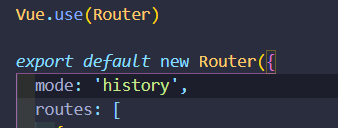

**过渡效果**

1.给<router-view/> 添加transition

```html
// mode 默认是 in-out  就是先进入在推出  这种效果不太好  最好是先退出 再进入 即 out-in
<transition name="fade" mode="out-in">
	<router-view/>
</transition>
```

2.写css样式

```css
.fade-enter{
  opacity: 0;
}
// 进入动画的过渡状态
.fade-enter-active{
  transition: opacity .5s;
}
.fade-leave{
  opacity: 1;
}
// 推出动画的过渡状态
.fade-leave-active{
  opacity: 0;
  transition: opacity .5s;
}
```

**mode: 'history' 去掉路由中的#/**



**mode: 'hash' 在路由中去掉#/**

**3.设置404页面**

```javascript

{
    path: '*',
    component: Error
}
// 引入写好 的 error 页面即可
```

