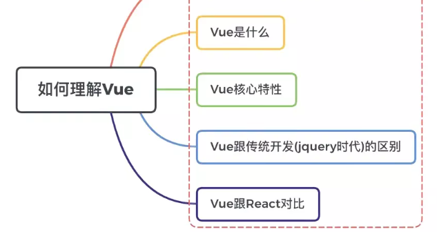
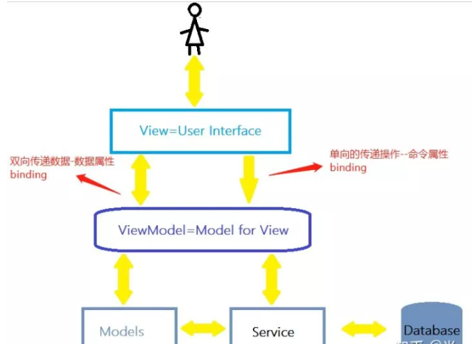

## 二、vue是什么

Vue.js（/vjuː/，或简称为Vue）

一个用于创建用户界面的开源的基于JavaScript的前端框架，关注的是MVC模式中的视图层；同时，它也能方便地获取数据更新，并通过组件内部特定的方法实现视图与模型的交互

最早发布于2014年2月

## 三、Vue核心特性

### 数据驱动（MVVM)

```
MVVM`表示的是 `Model-View-ViewModel
```

- Model：模型层，负责处理业务逻辑以及和服务器端进行交互

- View：视图层：负责将数据模型转化为UI展示出来，可以简单的理解为HTML页面

- ViewModel：视图模型层，用来连接Model和View，是Model和View之间的通信桥梁

  

- 

### 组件化

1.什么是组件化

一句话来说就是把图形、非图形的各种逻辑均抽象为一个统一的概念（组件）来实现开发的模式，在`Vue`中每一个`.vue`文件都可以视为一个组件

2.组件化的优势

- 降低整个系统的耦合度，在保持接口不变的情况下，我们可以替换不同的组件快速完成需求，例如输入框，可以替换为日历、时间、范围等组件作具体的实现
- 调试方便，由于整个系统是通过组件组合起来的，在出现问题的时候，可以用排除法直接移除组件，或者根据报错的组件快速定位问题，之所以能够快速定位，是因为每个组件之间低耦合，职责单一，所以逻辑会比分析整个系统要简单
- 提高可维护性，由于每个组件的职责单一，并且组件在系统中是被复用的，所以对代码进行优化可获得系统的整体升级

### 指令系统

解释：指令 (Directives) 是带有 v- 前缀的特殊属性

作用：当表达式的值改变时，将其产生的连带影响，响应式地作用于 DOM

- 常用的指令

- - 条件渲染指令 `v-if`
  - 列表渲染指令`v-for`
  - 属性绑定指令`v-bind`
  - 事件绑定指令`v-on`
  - 双向数据绑定指令`v-model`

#### 四、Vue跟传统开发的区别

没有落地使用场景的革命不是好革命，就以一个高频的应用场景来示意吧

注册账号这个需求大家应该很熟悉了，如下


用`jquery`来实现大概的思路就是选择流程dom对象，点击按钮隐藏当前活动流程dom对象，显示下一流程dom对象

如下图(代码就不上了，上了就篇文章就没了..)


用`vue`来实现，我们知道`vue`基本不操作`dom`节点， 双向绑定使`dom`节点跟视图绑定后，通过修改变量的值控制`dom`节点的各类属性。

所以其实现思路为：视图层使用一变量控制dom节点显示与否，点击按钮则改变该变量，如下图


总结就是：

- Vue所有的界面事件，都是只去操作数据的，Jquery操作DOM
- Vue所有界面的变动，都是根据数据自动绑定出来的，Jquery操作DOM

## 五、Vue和React对比

这里就做几个简单的类比吧，当然没有好坏之分，只是使用场景不同

### 相同点

- 都有组件化思想
- 都支持服务器端渲染
- 都有Virtual DOM（虚拟dom）
- 数据驱动视图
- 都有支持native的方案：`Vue`的`weex`、`React`的`React native`
- 都有自己的构建工具：`Vue`的`vue-cli`、`React`的`Create React App`

### 区别

- 数据流向的不同。`react`从诞生开始就推崇单向数据流，而`Vue`是双向数据流
- 数据变化的实现原理不同。`react`使用的是不可变数据，而`Vue`使用的是可变的数据
- 组件化通信的不同。`react`中我们通过使用回调函数来进行通信的，而`Vue`中子组件向父组件传递消息有两种方式：事件和回调函数
- diff算法不同。`react`主要使用diff队列保存需要更新哪些DOM，得到patch树，再统一操作批量更新DOM。`Vue` 使用双向指针，边对比，边更新DOM

