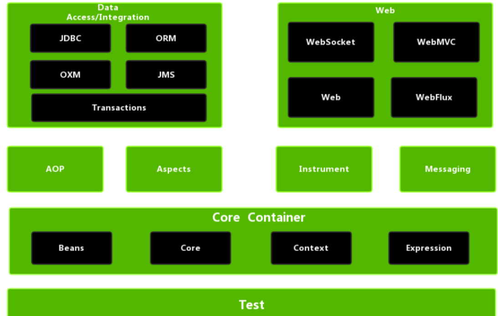
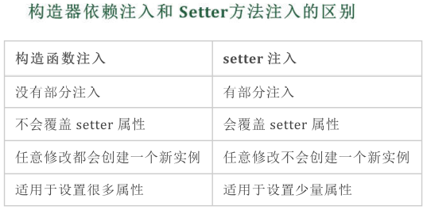

### spring框架的优缺点

```javascript
优点
1.开源免费轻量级
2.方便集成各种优秀框架 例如MyBatis
3.支持声明式事务和Aop编程
	只需通过配置就可以完成对事物的管理
4.简化java开发
缺点
1.使用门槛高  学习spring框架要很长时间
```

### spring如何简化java开发降低java开发的复杂性？

```javascript
1.通过依赖注入和面向接口实现松耦合
2.通过切面和模块减少样板代码
3.基于pojo的轻量级和最小侵入性编程
4.基于切面和惯例进行声明式编程
```

### spring框架的核心是什么?

```
ioc容器和aop模块
通过ioc容器管理pojo对象以及他们之间的耦合关系
通过aop以动态非入侵的方式增强服务
```

### spring的组成模块

```javascript
1.spring核心容器 提供了框架的基本组成部分 包含控制反转和依赖注入
2.数据整合模块 负责数据处理  例如对jdbc的封装
3.web模块 网络模块的整合  包含springMVC
4.AOP 面向切面编程
5.Test模块  对测试框架进行封装
```



### 详细讲解一下核心容器(spring context应用上下文)模块

```
这是基本的是spring模块，提供spring框架的基础功能，BeanFactory是任何以spring为基础的应用核心。spring框架建立在此模块上，它使spring成为一个容器。
```

### 什么是spring ioc容器？

```javascript
控制反转即ioc 是组件对象控制权的转移，从程序代码转移到了外部容器
```

### ioc的作用

```javascript
1.负责创建对象、管理对象(通过依赖注入)、装配对象、配置对象并且管理这些对象的整个生命周期
2.解耦，由ioc容器区维护具体的对象
```

### springioc的实现机制

```
实现原理就是工厂模式+反射机制
```

### springioc支持哪些功能?

```javascript
1.依赖注入
2.依赖检查
3.自动装配
4.支持集合
```

### 什么是spring依赖注入?

```
组件之间的依赖关系由容器在应用系统运行期来决定，即
由容器动态地将某种依赖关系的目标对象 注入到应用系统中的各个关联组件之中
```

### 依赖注入有那些实现方式?

```
1.构造器依赖注入: 通过容器触发一个类的构造器来实现
2.setter方法注入: 容器通过调用无参构造器或无参static工厂方法实例化bean之后，调用该bean的setter方法
区别:
```



### BeanFactory和ApplicationContext有什么区别?

```
https://blog.csdn.net/shangliangren/article/details/123937482
```

### spring框架用到了那些设计模式?

```javascript
1.单例模式 Bean默认为单例模式
2.工厂模式 BeanFactory用来创建对象的实例
3.代理模式 SpringAOP功能用到了JDK的动态代理和CGLIB字节码生成技术
4.观察者模式  实现场景 spring中listener的实现 ApplicationListener
```

### spring基于xml注入bean有哪些方式

```javascript
1.set方法注入
2.构造器注入
3.静态工厂注入
4.实例工厂
```

### spring bean支持的几种作用域

```javascript
1.singleton:bean在每一个Spring ioc容器中只有一个实例
2.prototype:一个bean的定义可以有多个实例
3.request:每次http请求都会创建一个bean 该作用域仅在基于web的Spring ApplicationContext情形下有效
4.session:在一个Http Session中，一个bean定义对应一个实例。该作用域仅在基于web的Spring ApplicationContext情形下有效。
5.global-session：在一个全局的Http Session中，一个bean定义对应一个实例。该作用域仅在基于web的Spring ApplicationsContext情形下有效。
```

### Spring 会话作用域的bean注入到单例作用域，设置代理后，代理怎么找到当前会话的bean?

```javascript
单例bean在初始化的时候，并不会创建会话bean，而是创建一个代理，在单例bean中调用会话bean的方法，并不会直接调用，而是先调用代理的方法，再由代理去调用会话bean的方法。

所以你的问题可以概括为，代理是如何找到会话bean的。

答案其实就如你所说，是通过线程来区分的。准确一点，是通过Web请求的Context来查找的。因为无论是request bean还是session bean，它们都是基于请求的，只是生命期有所不同，而请求一般来说是通过线程和请求上下文来区分的。
```

### 什么是线程安全?

```javascript
当多个线程访问某一个类（对象或方法）时，对象对应的公共数据区始终都能表现正确，那么这个类（对象或方法）就是线程安全的 否则不安全
```

### spring框架中的单例bean是线程安全的吗？

```javascript
不是  spring框架中的单例bean不是线程安全的
spring中bean默认为单例模式 spring框架并没有对单例bean进行多线程封装处理
要实现线程安全的话最简单的办法是改变bean的作用域 把singleton变成prototype
```

### spring框架中bean的生命周期

```javascript
大致可以分为5个阶段
1.创建前的准备 作用:Bean在加载前要从上下文和一些配置中去解析并查找Bean有关的扩展实现          
2.创建实例化 作用:通过反射去创建Bean的实例对象并扫描和解析Bean声明的一些属性
3.依赖注入 作用:如果被实例化的bean存在依赖其他bean对象的话则需要对这些依赖的bean进行对象注入
4.容器缓存 作用:把Bean保存到容器以及spring的缓存中  这时 bean就可以被开发者使用了
5.销毁实例 当spring的应用上下文被关闭的时候 那么这个上下文中所有的bean会被销毁
```

### 什么是反射?

```
对于任意一个类，都能够知道这个类的所有属性和方法；对于任意一个对象，都能够调用它的任意一个方法和属性;
获取Class对象的三种方式:
1. Object ——> getClass();
2. 任何数据类型（包括基本数据类型）都有一个“静态”的class属性
3. 通过Class类的静态方法：forName（String  className）(常用)
```

### 什么是spring内部bean?

```javascript
在spring框架中 当一个bean仅被用作另一个bean的属性时，它可以被声明为内部bean
```

### 什么是bean的自动装配?有哪些自动装配方式?

```javascript
spring框架能够自动装配相互合作的bean，自动搞定bean之间的依赖关系
自动装配方式(xml配置):
1.no: 默认不进行自动装配 通过手工设置ref属性来进行装配bean
2.byName: 通过bean的名称进行自动装配
3.byType: 通过参数的数据类型进行自动装配
```

### 你知道那些注解?@Autowired和@Resource之间的区别是什么?

```
@Component:spring的组件扫描机制注解
@Controller: 将类标记为Spring web mvc控制器的注解
@Service: 组件注解的特化 service层注解
@Repository:仓库注解
区别:
1.@Autowired默认是按照类型装配注入的 而@Resource默认时按照名称来装配的
2.@Autowired是Spring框架的注解 而@Resource是java的注解

如果两个类同时实现了一个接口,如何处理?
在实现类上@Service指明名称  @Resource在指明对应的名称即可
```

### 说一下spring的事务隔离?

```
1.未提交读
2.提交读
3.可重复读
4.序列化(代价最高最可靠的隔离级别)

脏读: 一个事务能够读取另一个事务中还未提交的事务
不可重复读:在同一个事物中 毒刺读取同一个数据
幻读: 同一个事物内多次查询返回的结果集不一样
```

### 什么是aop?

```javascript
aop 面向切面编程 将能影响多个对象的公共行为和逻辑抽取出来，做成一个可重用模块，这个模块被命名为"切面"，这样就减少了系统中的重复代码，降低了模块间的耦合度，提高了系统的可维护性
```

### aop的实现方式

```javascript
aop实现的关键在于代理模式，主要分为静态代理和动态代理，动态代理以spring aop为代表 静态代理则是以aspectJ为代表
```

### spring事物失效的场景

```
https://blog.csdn.net/qq_50652600/article/details/124471903
1.使用事物时 必须是publice访问权限 否则失效
2.方法用final,static修饰

```

### spring事物底层原理

```
https://blog.csdn.net/allen170257702/article/details/106325488/
```

### 什么是静态代理和动态代理?

```
静态代理:aop框架在编译阶段将切面织入到java字节码中，运行时就是增强之后的aop对象
动态代理:aop框架不修改字节码文件，每次运行时在内存中临时生成一个aop对象，在特定的切点做了增强处理，并回调元对象方法
```

### forword和重定向有什么区别？

```javascript
1.重定向地址改变，不会共享request对象
2.forword地址不会改变，会共享request对象
```


