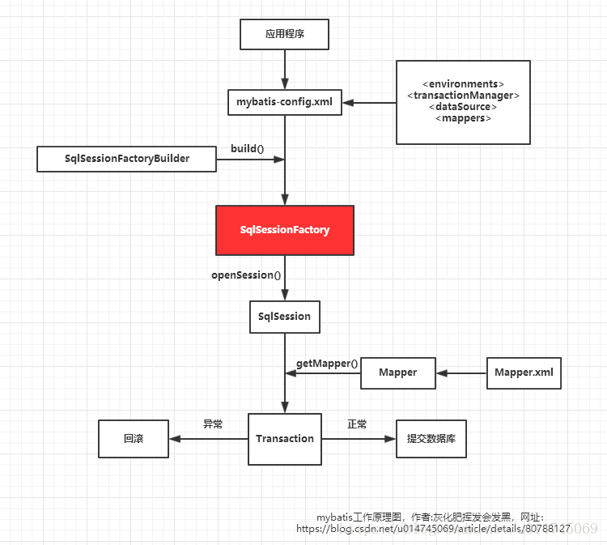
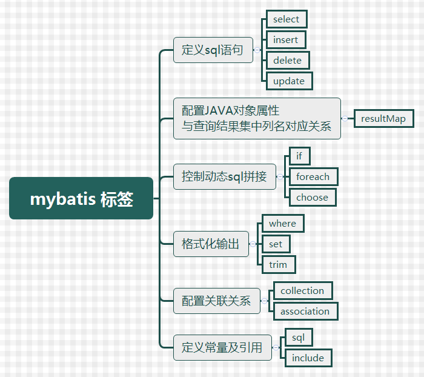

### MyBatis的优缺点

```javascript
优点:
1.性能高,轻量简单
2.与jdbc相比，减少了大量的代码量和冗余代码
3.能很好的和各种数据库兼容
4.能够和Spring框架集成
缺点:
1.SQL语句以来数据库，不能随意更换数据库
2.对SQL语句的编写能力有一定要求
```

### MyBatis的工作原理

```javascript
1.mybatis通过SqlSessionFactoryBuilder从mybatis-config.xml配置文件（也可以用Java文件配置的方式，需要添加@Configuration）来构建SqlSessionFactory（SqlSessionFactory是线程安全的）;

然后，SqlSessionFactory的实例直接开启一个SqlSession，再通过SqlSession实例获得Mapper对象并运行Mapper映射的SQL语句，完成对数据库的CRUD和事务提交，之后关闭SqlSession。

说明：SqlSession是单线程对象，因为它是非线程安全的，是持久化操作的独享对象，类似jdbc中的Connection，底层就封装了jdbc连接。
```



### Mybatis的常用标签



### 说说mybatis的一、二级缓存?

参考 https://blog.csdn.net/guorui_java/article/details/118095020

#### 什么是缓存?

```
缓存是存在于内存中的临时数据。使用缓存可以减少和数据库的交互次数，提高执行效率。
```

#### 缓存适用的场景

```js
经常查询并且不经常改变的；
```

#### mybatis一级缓存

```
1、一级缓存简介
一级缓存作用域是sqlsession级别的，同一个sqlsession中执行相同的sql查询（相同的sql和参数），第一次会去查询数据库并写到缓存中，第二次从一级缓存中取。一级缓存是基于 PerpetualCache 的 HashMap 本地缓存，默认打开一级缓存。

2、何时清空一级缓存
如果中间sqlSession去执行commit操作（执行插入、更新、删除），则会清空SqlSession中的一级缓存，这样做的目的为了让缓存中存储的是最新的信息，避免脏读。

一级缓存时执行commit，close，增删改等操作，就会清空当前的一级缓存；当对SqlSession执行更新操作（update、delete、insert）后并执行commit时，不仅清空其自身的一级缓存（执行更新操作的效果），也清空二级缓存（执行commit()的效果）。

3、一级缓存无过期时间，只有生命周期
MyBatis在开启一个数据库会话时，会创建一个新的SqlSession对象，SqlSession对象中会有一个Executor对象，Executor对象中持有一个PerpetualCache对象。当会话结束时，SqlSession对象及其内部的Executor对象还有PerpetualCache对象也一并释放掉。
```

### mybatis一级缓存应用实例

参考 https://www.cnblogs.com/niujifei/p/15243662.html

```
1.依赖注入SqlSessionFactory对象
@Resource
private SqlSessionFactory sqlSessionFactory;
2.通过sqlSessionFactory获取SqlSession对象  保证为同一个SqlSession
SqlSession sqlSession = sqlSessionFactory.openSession();
3.获取相应的mapper类
SysMenuMapper sysMenuMapper1 = sqlSession.getMapper(SysMenuMapper.class);
```

### mybatis缓存失效情况

```
一级缓存失效情况（没有使用到当前一级缓存的情况，效果就是，还需要再向数据发送SQL）

　　1、sqlSession 不同：使用不同的 sqlSession 数据库会话，不同的 SqlSession 对应不同的一级缓存；

　　2、sqlSession 相同：但查询条件不同（当前一级缓存中还没有这个数据）

　　3、如果sqlSession相同：两次查询之间执行了增删改操作（这次增删改可能对当前数据有影响）

　　4、如果sqlSession相同，手动清除了一级缓存（把缓存内容清空）

　　SqlSession 级别的缓存就相当于一个 Map。
```

### mybatis缓存应用场景

```
没有太大意义  直接在内存中获取同一个对象即可。
```


#### mybatis二级缓存

参考 https://blog.csdn.net/qq_21383435/article/details/124768956

```
1、二级缓存简介
它指的是Mybatis中SqlSessionFactory对象的缓存。由同一个SqlSessionFactory对象创建的SqlSession共享其缓存。

二级缓存是 mapper 映射级别的缓存，多个 SqlSession 去操作同一个 Mapper 映射的 sql 语句，多个SqlSession 可以共用二级缓存，二级缓存是跨 SqlSession 的。

2、二级缓存何时存入
在关闭sqlsession后(close)，才会把该sqlsession一级缓存中的数据添加到namespace的二级缓存中。

开启了二级缓存后，还需要将要缓存的pojo实现Serializable接口，为了将缓存数据取出执行反序列化操作，因为二级缓存数据存储介质多种多样，不一定只存在内存中，有可能存在硬盘中。

3、二级缓存有过期时间，但没有后台线程进行检测
需要注意的是，并不是key-value的过期时间，而是这个cache的过期时间，是flushInterval，意味着整个清空缓存cache，所以不需要后台线程去定时检测。

每当存取数据的时候，都有检测一下cache的生命时间，默认是1小时，如果这个cache存活了一个小时，那么将整个清空一下。

4、当 Mybatis 调用 Dao 层查询数据库时，先查询二级缓存，二级缓存中无对应数据，再去查询一级缓存，一级缓存中也没有，最后去数据库查找。
```


```javascript
mybatis默认是打开一级缓存，存储作用域为Session
使用二级缓存需要实现序列化，二级缓存的存储作用域为Mapper 可在映射文件中配置<cache/>
```

### 传参#和$有什么区别?

参考 https://blog.csdn.net/qq_58772217/article/details/122099893

参考 https://www.zhihu.com/question/26914370

```
主要区别:
1.#传入的参数在SQL中显示为字符串，$传入的参数在SqL中直接显示为传入的值.
2.#方式能够很大程度防止sql注入，$方式无法防止Sql注入；
3.$方式一般用于传入数据库对象，例如传入表名。
能用#就用# 
```

### mybatis批量添加

```java
1.在数据库连接的url中添加 &allowMultiQueries=true&rewriteBatchedStatements =true 把批处理开启
2.书写sql语句  使用foreach标签来遍历批数据
3.调用相应的方法即可
eg:
xml中sql语句
<insert id="batchAddMenu" parameterType="list">
// collection遍历集合 item为每一项 separator 为sql语句之间的间隔
<foreach collection="list" item="it" separator=";">
insert into sys_menu(
<if test="it.parentMenuId != null and it.parentMenuId != ''">parent_menu_id,</if>
<if test="it.orderNum != null and it.orderNum != 0">order_num,</if>
<if test="it.menuLevel != null and it.menuLevel != 0">menu_level,</if>
<if test="it.menuName != null and it.menuName != ''">menu_name,</if>
<if test="it.routerUrl != null and it.routerUrl != ''">url,</if>
menu_id
)values(
<if test="it.parentMenuId != null and it.parentMenuId != ''">#{it.parentMenuId},</if>
<if test="it.orderNum != null and it.orderNum != 0">#{it.orderNum},</if>
<if test="it.menuLevel != null and it.menuLevel != 0">#{it.menuLevel},</if>
<if test="it.menuName != null and it.menuName != ''">#{it.menuName},</if>
<if test="it.routerUrl != null and it.routerUrl != ''">#{it.routerUrl},</if>
#{it.menuId}
)
</foreach>
</insert>
```

