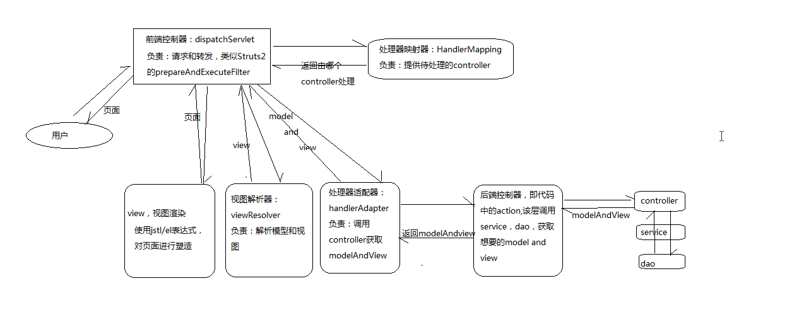

### MVC是什么？mvc设计模式的好处有那些?

```javascript
MVC是一种设计模式  模型(model)-视图(view)-控制器(controller) 三层架构的设计模式
优点:分层设计  有利于系统的并行设计 提升开发效率
```

### springMVC的优点(好处)

```javascript
1.可以与spring框架集成 
2.可支持各种视图技术 不仅仅jsp页面
3.清晰的角色分配:  前端处理器(dispatcherServlet) 请求到处理器映射(handlerMapping) 处理器适配器(handlerAdapter) 视图解析器(viewResolver)
```

### springmvc的常用注解有哪些?

```javascript
1.@RequestMapping 处理请求url映射的注解
2.@RequestBody 接收json数据 将json数据转化为java对象 
3.@Resquestparam  接收具体的属性值
4.@ResponseBody  将java对象转化为json数据对象响应给用户
5.@RestController = @ResponseBody + @Controller
6.@Controller 控制器注解  注明此类是控制器类
```

### post请求和get请求的区别

```javascript
1.post请求是加密的  get请求不是加密的
2.post请求数据量没有上限  get请求有数据量限制
3.post请求是客户端向服务器端发送请求 get是从服务器上获取数据
```

### springMVC的主要组件

```javascript
1.前端控制器(dispatcherServlet) 作用:接受请求、响应结果，相当于转发器 处理所有http请求和响应  降低了其他组件的耦合度 
2.处理器映射器(handlerMapping) 作用:根据请求的URL来查找Handler
3.处理器适配器(handlerAdapter)
4.处理器Handler(需要程序员开发)
5.视图解析器(viewResolver) 作用:进行视图解析
6.视图View(需要程序员开发前端页面)
```

### springMVC的工作原理

```javascript
1.浏览器发送http请求到DispatcherServlet
2.DispatcherServlet调用处理器映射器(handlerMapping)  请求获取handle
3.处理器映射器(handlerMapping) 根据Url找到具体的handler 返回给DispatcherServlet
4.DispatcherServlet 调用处理器适配器(handlerAdapter) 处理器适配器(handlerAdapter)调用具体的Handler
5.handler执行完成并且放回结果给ModelAndView
6.处理器适配器(handlerAdapter) 将ModelAndView 返回给DispatcherServlet
7.DispatcherServlet 将ModelAndView 返回给视图解析器(viewResolver)
8.视图解析器(viewResolver) 返回具体的View 给DispatcherServle
9.DispatcherServle 对view进行渲染并响应用户
主要分三步: 
    1.通过处理器映射器(handlerMapping)获取handle
    2.处理器适配器(handlerAdapter) 根据具体的handler获取ModelAndView
    3.视图解析器(viewResolver)根据ModelAndView 返回具体的view  
	中间的控制者是前端控制器(dispatcherServlet)
```



### springmvc重定向和转发的区别

```
转发：是服务器内部的跳转，浏览器的地址栏不会发生变化。从一个页面到另一个页面的跳转还是同一个请求，也即是只有一个请求响应。可以通过request域来传递对象。forword
重定向：是浏览器自动发起对跳转目标的请求，浏览器的地址栏会发生变化。从一个页面到另一个页面的跳转是不同的请求，也即是有两个或两个以上的不同的请求的响应。无法通过request域来传递对象。sendRedirect
```

