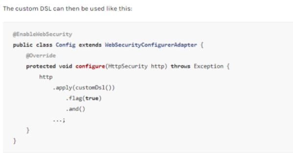
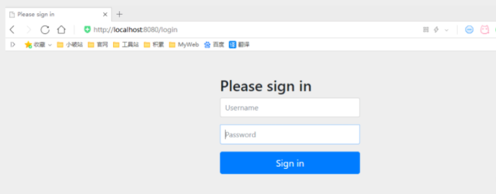

参考网址 https://mp.weixin.qq.com/s/FLdC-24_pP8l5D-i7kEwcg

### 认识SpringSecurity

```java
Spring Security 是针对Spring项目的安全框架，也是Spring Boot底层安全模块默认的技术选型，他可以实现强大的Web安全控制，对于安全控制，我们仅需要引入 spring-boot-starter-security 模块，进行少量的配置，即可实现强大的安全管理！

记住几个类：

WebSecurityConfigurerAdapter：自定义Security策略

AuthenticationManagerBuilder：自定义认证策略

@EnableWebSecurity：开启WebSecurity模式

Spring Security的两个主要目标是 “认证” 和 “授权”（访问控制）。

“认证”（Authentication）

身份验证是关于验证您的凭据，如用户名/用户ID和密码，以验证您的身份。

身份验证通常通过用户名和密码完成，有时与身份验证因素结合使用。

 “授权” （Authorization）

授权发生在系统成功验证您的身份后，最终会授予您访问资源（如信息，文件，数据库，资金，位置，几乎任何内容）的完全权限。

这个概念是通用的，而不是只在Spring Security 中存在。
```

### 认证和授权

1、引入 Spring Security 模块

```xml
<dependency>
   <groupId>org.springframework.boot</groupId>
   <artifactId>spring-boot-starter-security</artifactId>
</dependency>
```

2、编写 Spring Security 配置类

参考官网：https://spring.io/projects/spring-security 

查看我们自己项目中的版本，找到对应的帮助文档：

https://docs.spring.io/spring-security/site/docs/5.3.0.RELEASE/reference/html5  #servlet-applications 8.16.4



3、编写基础配置类

```java
package com.kuang.config;

import org.springframework.security.config.annotation.web.builders.HttpSecurity;
import org.springframework.security.config.annotation.web.configuration.EnableWebSecurity;
import org.springframework.security.config.annotation.web.configuration.WebSecurityConfigurerAdapter;

@EnableWebSecurity // 开启WebSecurity模式
public class SecurityConfig extends WebSecurityConfigurerAdapter {

   @Override
   protected void configure(HttpSecurity http) throws Exception {
       
  }
}
```

4、定制请求的授权规则

```java
@Override
protected void configure(HttpSecurity http) throws Exception {
   // 定制请求的授权规则
   // 首页所有人可以访问
   http.authorizeRequests().antMatchers("/").permitAll()
  .antMatchers("/level1/**").hasRole("vip1")
  .antMatchers("/level2/**").hasRole("vip2")
  .antMatchers("/level3/**").hasRole("vip3");
}
```

5、测试一下：发现除了首页都进不去了！因为我们目前没有登录的角色，因为请求需要登录的角色拥有对应的权限才可以！

6、在configure()方法中加入以下配置，开启自动配置的登录功能！

```java
// 开启自动配置的登录功能
// /login 请求来到登录页
// /login?error 重定向到这里表示登录失败
http.formLogin();
```

7、测试一下：发现，没有权限的时候，会跳转到登录的页面！




8、查看刚才登录页的注释信息；我们可以定义认证规则，重写configure(AuthenticationManagerBuilder auth)方法

```java
/定义认证规则
@Override
protected void configure(AuthenticationManagerBuilder auth) throws Exception {
   
   //在内存中定义，也可以在jdbc中去拿....
   auth.inMemoryAuthentication()
          .withUser("kuangshen").password("123456").roles("vip2","vip3")
          .and()
          .withUser("root").password("123456").roles("vip1","vip2","vip3")
          .and()
          .withUser("guest").password("123456").roles("vip1","vip2");
}
```

9、测试，我们可以使用这些账号登录进行测试！发现会报错！

10、原因，我们要将前端传过来的密码进行某种方式加密，否则就无法登录，修改代码

```java
//定义认证规则
@Override
protected void configure(AuthenticationManagerBuilder auth) throws Exception {
   //在内存中定义，也可以在jdbc中去拿....
   //Spring security 5.0中新增了多种加密方式，也改变了密码的格式。
   //要想我们的项目还能够正常登陆，需要修改一下configure中的代码。我们要将前端传过来的密码进行某种方式加密
   //spring security 官方推荐的是使用bcrypt加密方式。
   
   auth.inMemoryAuthentication().passwordEncoder(new BCryptPasswordEncoder())
          .withUser("kuangshen").password(new BCryptPasswordEncoder().encode("123456")).roles("vip2","vip3")
          .and()
          .withUser("root").password(new BCryptPasswordEncoder().encode("123456")).roles("vip1","vip2","vip3")
          .and()
          .withUser("guest").password(new BCryptPasswordEncoder().encode("123456")).roles("vip1","vip2");
}
```

### 权限控制和注销

```java
//定制请求的授权规则
@Override
protected void configure(HttpSecurity http) throws Exception {
   //....
   //开启自动配置的注销的功能
      // /logout 注销请求
   http.logout();
}
```

### 记住我

1、开启记住我功能

```java
//定制请求的授权规则
@Override
protected void configure(HttpSecurity http) throws Exception {
//。。。。。。。。。。。
   //记住我
   http.rememberMe();
}
```

原理：登录成功后，将cookie发送给浏览器保存，以后登录带上这个cookie，只要通过检查就可以免登录了。如果点击注销，则会删除这个cookie，具体的原理我们在JavaWeb阶段都讲过了，这里就不在多说了！

### 代码 

```java
package com.kuang.config;

import org.springframework.security.config.annotation.authentication.builders.AuthenticationManagerBuilder;
import org.springframework.security.config.annotation.web.builders.HttpSecurity;
import org.springframework.security.config.annotation.web.configuration.EnableWebSecurity;
import org.springframework.security.config.annotation.web.configuration.WebSecurityConfigurerAdapter;
import org.springframework.security.crypto.bcrypt.BCryptPasswordEncoder;

@EnableWebSecurity
public class SecurityConfig extends WebSecurityConfigurerAdapter {

   //定制请求的授权规则
   @Override
   protected void configure(HttpSecurity http) throws Exception {

       http.authorizeRequests().antMatchers("/").permitAll()
      .antMatchers("/level1/**").hasRole("vip1")
      .antMatchers("/level2/**").hasRole("vip2")
      .antMatchers("/level3/**").hasRole("vip3");


       //开启自动配置的登录功能：如果没有权限，就会跳转到登录页面！
           // /login 请求来到登录页
           // /login?error 重定向到这里表示登录失败
       http.formLogin()
          .usernameParameter("username")
          .passwordParameter("password")
          .loginPage("/toLogin")
          .loginProcessingUrl("/login"); // 登陆表单提交请求

       //开启自动配置的注销的功能
           // /logout 注销请求
           // .logoutSuccessUrl("/"); 注销成功来到首页

       http.csrf().disable();//关闭csrf功能:跨站请求伪造,默认只能通过post方式提交logout请求
       http.logout().logoutSuccessUrl("/");

       //记住我
       http.rememberMe().rememberMeParameter("remember");
  }

   //定义认证规则
   @Override
   protected void configure(AuthenticationManagerBuilder auth) throws Exception {
       //在内存中定义，也可以在jdbc中去拿....
       //Spring security 5.0中新增了多种加密方式，也改变了密码的格式。
       //要想我们的项目还能够正常登陆，需要修改一下configure中的代码。我们要将前端传过来的密码进行某种方式加密
       //spring security 官方推荐的是使用bcrypt加密方式。

       auth.inMemoryAuthentication().passwordEncoder(new BCryptPasswordEncoder())
              .withUser("kuangshen").password(new BCryptPasswordEncoder().encode("123456")).roles("vip2","vip3")
              .and()
              .withUser("root").password(new BCryptPasswordEncoder().encode("123456")).roles("vip1","vip2","vip3")
              .and()
              .withUser("guest").password(new BCryptPasswordEncoder().encode("123456")).roles("vip1","vip2");
  }
}
```

### Spring Security 的底层实现原理

参考 https://blog.csdn.net/weixin_43738764/article/details/119037764

```

```


### Spring Security与Shiro区别？

```
Spring Security 是一个重量级的安全管理框架；Shiro是一个轻量级的安全管理框架。
Spring Security概念复杂，配置繁琐；Shiro概念简单，配置简单。
Spring Security功能强大，Shiro功能简单。
```


