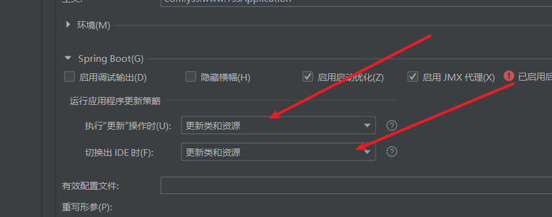

### 什么是springboot?

```
Springboot是Spring开源组织下的子项目，是Spring组件一站式解决方案，降低了spring的难度，简省了繁重的配置，开发者能快速上手
```

### springBoot的优点有那些?

```
1.容易上手，提升开发效率
2.开箱即用，远离繁琐的配置
3.没有代码生成，无需xml配置
4.内嵌应用服务器
```

### springboot的核心注解是什么?

```
启动类上的@SpringBootApplication,由三个注解组成
1.@SpringBootConfiguration
2.@EnableAutoConfiguration
3.@ComponentScan spring组件扫描
```

### springboot自动配置原理是什么?

```js
注解 @EnableAutoConfiguration @Configuration @conditiongalOnClass就是自动配置的核心
```

### springboot配置文件种类有哪些?

```java
1.yaml文件  yaml是分层配置数据的
2.properties文件 属性名: 属性值的数据配置方式
```

### yaml配置的优势

```javascript
1.配置有序
2.支持数组
3.简洁
```

### springboot的核心配置文件是什么?他们之间有什么区别？

```javascript
有两种配置文件 bootstrap.properties和 application.properties
区别:
1.bootstrap: 比application优先加载并且里面的属性不能被覆盖
2.application
```

### 如何实现springboot应用程序的安全性?

```
引入spring-boot-starter-security依赖项并且添加安全配置
```

### springboot如何实现热部署?

```javascript
参考 https://blog.csdn.net/moshubai/article/details/117307698
1.引入spring-boot-devtools依赖
<dependency>
    <groupId>org.springframework.boot</groupId>
    <artifactId>spring-boot-devtools</artifactId>
    <version>2.7.0</version>
</dependency>
2.编辑运行设置
```



### springboot打成的jar包和普通jar包有什么区别?

```javascript
boot打成的jar包时可执行jar包，不可 其他项目依赖，普通jar包可以被依赖
解决方案: 在pom.xml中增加配置，将boot项目打包成两个jar包，一个是可执行的，一个是可引用的
```

### springboot如何解决跨域问题

```java
在同级启动类的目录中创建新的类
package com.example.demo.config;

import org.springframework.context.annotation.Bean;
import org.springframework.context.annotation.Configuration;
import org.springframework.web.servlet.config.annotation.CorsRegistry;
import org.springframework.web.servlet.config.annotation.WebMvcConfigurer;

/**
 * @author yss
 * @date 2022年03月06日 11:03
 */
@Configuration
public class CrosConfig{
    @Bean
    public WebMvcConfigurer corsConfigurer(){
        return new WebMvcConfigurer() {
            @Override
            public void addCorsMappings(CorsRegistry registry) {
                registry.addMapping("/**")
                        .allowedHeaders("*")
                        .allowedMethods("*")
                        .allowedOrigins("*");
            }
        };
    }
}
```

### springboot 做文件上传下载服务

#### 1.引入hutools包

```javascript
/工具类 
<dependency>
    <groupId>cn.hutool</groupId>
    <artifactId>hutool-all</artifactId>
    <version>5.0.7</version>
</dependency>
```

#### 2.boot后端代码编写

##### 1.AppFileUtils.java

```java
package com.example.demo.common;

import cn.hutool.core.io.FileUtil;
import cn.hutool.core.util.IdUtil;
import org.springframework.http.HttpHeaders;
import org.springframework.http.HttpStatus;
import org.springframework.http.MediaType;
import org.springframework.http.ResponseEntity;

import java.io.File;
import java.io.IOException;
import java.io.InputStream;
import java.util.Properties;

/**
 * 文件上传下载工具类
 * @author yss
 * @date 2022年03月07日 22:11
 */
public class AppFileUtils {

    // 文件上传路径
    public static String UPLOAD_PATH="D:/upload/";  // 默认值

    // 加载配置文件
    static {
        // 读取配置文件的存储地址
        InputStream stream = AppFileUtils.class.getClassLoader().getResourceAsStream("file.properties");
        Properties properties = new Properties();
        try {
            properties.load(stream);
        } catch (IOException e) {
            e.printStackTrace();
        }
        // 判断是否为null
        String p = properties.getProperty("filepath");
        if (null != p){
            UPLOAD_PATH = p;
        }
    }

    /**
     * 根据老名字得到新名字
    * */
    public static String createNewFileName(String oldName) {
        String stuff = oldName.substring(oldName.lastIndexOf("."),oldName.length());
        // 使用hutools包来生成新名字
        return IdUtil.simpleUUID().toUpperCase()+stuff;
    }

    /**
     * 文件下载*/
    public static ResponseEntity<Object> createResponseEntity(String path) {
        // 1.构造文件对象
        File file = new File(UPLOAD_PATH,path);
        if (file.exists()){
            // 将文件下载到本地
            byte[] bytes = null;
            try {
                bytes = FileUtil.readBytes(file);
            } catch (Exception e) {
                e.printStackTrace();
            }
            // 创建封装响应头信息的对象
            HttpHeaders header = new HttpHeaders();
            // 封装响应内容类型
            header.setContentType(MediaType.APPLICATION_OCTET_STREAM);
            // 设置下载文件名称
            header.setContentDispositionFormData("attachment","123.jpg");

            // 创建ResponseEntity对象
            return new ResponseEntity<Object>(bytes,header, HttpStatus.CREATED);
        }
        return null;
    }
}
```

##### 2.FileController

```java
package com.example.demo.config;

import cn.hutool.core.date.DateUtil;
import com.example.demo.common.AppFileUtils;
import org.springframework.http.ResponseEntity;
import org.springframework.web.bind.annotation.RequestMapping;
import org.springframework.web.bind.annotation.RequestMethod;
import org.springframework.web.bind.annotation.RestController;
import org.springframework.web.multipart.MultipartFile;

import java.io.File;
import java.io.IOException;
import java.util.Date;
import java.util.HashMap;
import java.util.Map;

/**
 * @author yss
 * @date 2022年03月07日 22:05
 */
@RestController
@RequestMapping("/file")
public class FileController {
    /**
    * 文件上传
    *
    * */
    @RequestMapping(value = "/upload",method = RequestMethod.POST)
    public Map<String,Object> uploadFile(MultipartFile mf){
        // 1.得到文件名
        String oldName = mf.getOriginalFilename();
        // 2.根据文件名生成新的文件名
        String newName = AppFileUtils.createNewFileName(oldName);
        // 3.得到当前日期的字符串
        String dirName = DateUtil.format(new Date(),"yyyy-MM-dd");
        // 4.构造文件夹
        File dirFile = new File(AppFileUtils.UPLOAD_PATH,dirName);
        // 5.判断当前文件夹是否存在
        if(!dirFile.exists()){
            // 创建文件夹
            dirFile.mkdir();
        }
        // 6.构造文件对象
        File file = new File(dirFile,newName);
        // 7.把mf里面的图片信息写入file
        try {
            mf.transferTo(file);
        } catch (IOException e) {
            e.printStackTrace();
        }
        Map<String,Object> map = new HashMap<>();
        map.put("path",dirName+"/"+newName);
        return map;
    }

    /**
     * 文件下载
     *
     * */
    @RequestMapping(value = "/showImageByPath",method = RequestMethod.GET)
    public ResponseEntity<Object>  showImageByPath(String path){
        return AppFileUtils.createResponseEntity(path);
    }
}
```

```
Invalid bound statement (not found) 终极解决办法
网上已经有很多文章说明可能导致这个报错的原因，无非是以下几种：
1.检查xml文件的namespace是否正确

2.Mapper.java的方法在Mapper.xml中没有，然后执行Mapper的方法会报此

3.xxxMapper.java的方法返回值是List,而select元素没有正确配置ResultMap,或者只配置ResultType

4.如果你确认没有以上问题,请任意修改下对应的xml文件,比如删除一个空行,保存.问题解决

5.看下mapper的XML配置路径是否正确，比如：resource目录下的mapper，yml文件却写的mappers；再比如你的mapper放在其他目录下

6、构建没有进去，请看一下target文件夹下面这些是否存在，没有请重新构建，maven处clean，再重新run试试
```


