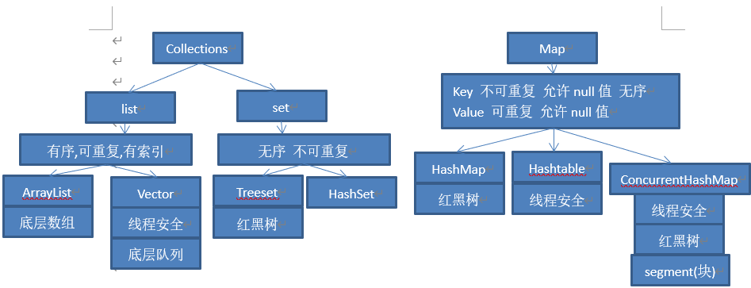

### jdk收费版本

参考 https://blog.csdn.net/qq_26721093/article/details/126075560

```
oracle jdk 
1.8u202之前免费 之后收费(商用)   私用都免费
下载地址https://www.oracle.com/java/technologies/javase/javase8-archive-downloads.html
openjdk全免费

个人建议：linux服务器上 
1.1.8 装商用免费版本
2.1.11 1.17 装openjdk 开源免费
个人开发: 随意装 没有限制 因为私用免费
```

### java与C的关系

```js
1.语言跨平台：
C语言不可以跨平台，JAVA 是不怕这一点的，因为Java可以跨平台，在windows 和 unix 等系统上都可以很好的运行。

2.封装
在java中引入了package的概念，使面向对象和面向组件开发更加方便，而在c语言中没有package概念，需要其他方式来实现。Java都能够实现面向对象思想（封装，继乘，多态）。而由于c语言为了照顾大量的C语言使用者，而兼容了C，使得自身仅仅成为了带类的C语言，多多少少影响了其面向对象的彻底性！JAVA则是完全的面向对象语言，它句法更清晰，规模更小，更易学。它是在对多种程序设计语言进行了深入细致研究的基础上，据弃了其他语言的不足之处，从根本上解决了c语言的固有缺陷。

3.数据类型及类
Java是完全面向对象的语言，所有函数和变量部必须是类的一部分。除了基本数据类型之外，其余的都作为类对象，包括数组。对象将数据和方法结合起来，把它们封装在类中，这样每个对象都可实现自己的特点和行为。而c语言允许将函数和变量定义为全局的。

7.字符串：
C语言不支持字符串变量，在c语言程序中使用Null终止符代表字符串的结束，在Java中字符串是用类对象(strinR和stringBuffer)来实现的，这些类对象是Java语言的核心！
```

### java基本数据类型及其包装类型 拆箱 装箱

```js
数值型 byte short int long float double
char
boolean

包装类型
数值型 Byte Short Integer Long Float Double
Character
Boolean

基本数据类型都是有默认值的 例如boolean为false int为0等 而包装类型默认为null,故一般类属性声明为基本数据类型无法调用Object类中的方法，包装类才能调用，java中一切皆对象。Obiect类是所有类祖先。

装箱 基本数据类型 -> 其包装类型
拆箱 包装类型 -> 其基本数据类型
```

### jdk8新特新有哪些?

```javascript
1.lambda 表达式  i->{}
2.链式编程和Stream流计算
3.新增时间 LocalDateTime  和 线程安全的格式化类 DateTimeFormatter
4.新增StringJoiner类 用于字符串的拼接
```

```java
eg:
/**
 * 1.ID 为偶数
 * 2.年龄大于 23岁
 * 3.用户名转为大写
 * 4.用户名字母倒序
 * 5.只输出一个用户
 */
User u1 = new User(1,12,"a");
        User u2 = new User(2,12,"b");
        User u3 = new User(3,42,"c");
        User u4 = new User(4,25,"d");
        User u5 = new User(6,25,"e");
        List<User> list = Arrays.asList(u1,u3,u2,u4,u5);
        list.stream()
                .filter(u->{return u.getId()%2==0;})
                .filter(u->{return u.getAge()>23;})
                .map(u->{return u.getName().toUpperCase();})
                .sorted(Comparator.reverseOrder())
                .limit(1)
                .forEach(System.out::println);
```

### String类

```
1.字符串最大长度为多少?
	编译期: 2^16 -1 65534
	运行期: char[]数组存储 理论上是 2^31 -1 即21亿 共需4G存储空间实际上受jvm分配的内存限制
2.有那些常用方法?
	1.equals()  相等  建议使用确定的字符串.euqals()
	2.length()  获取字符串的长度  空格也算 多一个空格长度，长度就+1
	3.split() 用什么分割字符串 返回String[]数组
	4.substring() 切割字符串 去尾
    .......
3.new String() 创建了几个对象?
	1个或者两个  如果初始化的值在字符串常量池中已经有了，就是1个。没有就是2个对象。
```

### 值传递和引用传递

```
java中只有值传递 没有引用传递  形参始终拿到的是实参的副本()
值传递: 对形参的修改不会影响到实参
引用传递: 对形参的修改会影响到实参
```

### StringJoiner例子

```java
// StringJoiner非线程安全 第一个参数 为分隔符  第二个是前缀 第三个是后缀
StringJoiner stringJoiner = new StringJoiner(",","{","}");
for (int i = 0;i<10;i++){
    stringJoiner.add(String.valueOf(i));
}
System.out.println(stringJoiner);  // {0,1,2,3,4,5,6,7,8,9}
// StringBuffer是线程安全的类
StringBuffer stringBuffer = new StringBuffer("");
stringBuffer.append("{");
for (int i = 0;i<10;i++){
    stringBuffer.append((i)+",");
}
// 去掉最后一个,
stringBuffer.deleteCharAt(stringBuffer.length()-1);
stringBuffer.append("}");
System.out.println(stringBuffer); // {0,1,2,3,4,5,6,7,8,9}
```

### jdk17 新特性(与jdk8对比)

```java
1. switch判断值的时候 case  使用 -> 后 就不用break了
2. 新增stream.toList()(返回的list不可变)方法用于对集合的处理。jdk8使用的是stream.collect(Collectors.toList())(返回的list可变)
3.String类底层由char[]数组变为byte[]
4.var关键字 简化开发 eg:
var map = new ConcurrentHashMap<String, String>();==Map<String, String> map = new ConcurrentHashMap<String, String>();
5.密封类:1.限定子类 使用关键字sealed permits修饰  子类必须使用final 或者non-sealed 和sealed 修饰类  
     * final表示子类不可被继承
     * non-sealed 表示子类可以被任何类继承
     * sealed 限定子类
     * 注意: 密封类和子类必须在同一个包下
6.TreeMap的增强
```

### java反射

```java
反射的作用: 通过反射机制可以操作字节码文件，操作代码片段
获取反射对象
第一种方法: 通过 对象名.getClass() 这种方式使用的比较少
第二种方式: 通过 类名.class 来获取
第三种方式: Class.forName(“完整的包名+类名”) 这种方式比较常用
反射是可以获取私有成员变量的值，但是需要设置setAccessible()为true
```

### java注解

```java
java 内置注解
@SuppressWarnings:抑制编译器警告
@Override:限定重写父类方法,该注解只能用于方法
```

#### 自定义注解 @interface

```java
自定义注解
	* 格式：
		元注解
		public @interface 注解名称{
			属性列表;
		}

	* 本质：注解本质上就是一个接口，该接口默认继承Annotation接口
		* public interface MyAnno extends java.lang.annotation.Annotation {}

	* 属性：接口中的抽象方法
		* 要求：
			1. 属性的返回值类型有下列取值
				* 基本数据类型
				* String
				* 枚举
				* 注解
				* 以上类型的数组
			2. 定义了属性，在使用时需要给属性赋值
				1. 如果定义属性时，使用default关键字给属性默认初始化值，则使用注解时，
					可以不进行属性的赋值。
				2. 如果只有一个属性需要赋值，并且属性的名称是value，则value可以省略
					直接定义值即可。
				4. 数组赋值时，值使用{}包裹。如果数组中只有一个值，则{}可以省略
	* 元注解：用于描述注解的注解
		* @Target：描述注解能够作用的位置
			* ElementType取值：
				* TYPE：可以作用于类上
				* METHOD：可以作用于方法上
				* FIELD：可以作用于成员变量上
		* @Retention：描述注解被保留的阶段
			* @Retention(RetentionPolicy.RUNTIME)：当前被描述的注解，会保留到class字节
				码文件中，并被JVM读取到
		* @Documented：描述注解是否被抽取到api文档中
		* @Inherited：描述注解是否被子类继承
```

### java枚举类

```
Java枚举是一个特殊的类，一般表示一组常量  可以更方便的明白各个属性的含义  限制语义 可用于switch判断 并且自带了多个方法提供使用
格式:
enum 类名
{
    属性值1,属性值2......
}
例如:
enum Color
{
    // 红
    RED,
    GREEN,
    BLUE;
}
使用: 类名.属性值  Color.RED
常用方法 
1.values() : 获取所有属性值 数组形式
2.valueOf() 与.类似
```

### java泛型

```
定义: 把数据类型当做参数使用。在使用的时候需要什么类型就传什么数据类型进去。
好处:避免了类型强转的麻烦。确保了传递参数的类型与指定类型相同，否则报红。
```

### final 关键字

```
final关键字代表最终、不可改变的。
常见四种用法：
1. 修饰类  该类不能被继承  
2. 修饰方法 该方法不能被重写
3. 修饰变量 地址值不可改变  只能赋值一次
```

### static关键字

```java
所有static关键字修饰的都是类相关的，类级别的。
所有static修饰的，都是采用“类名.”的方式访问。
static修饰的变量：静态变量
static修饰的方法：静态方法
```

#### 泛型通配符的使用

```
泛型的通配符:不知道使用什么类型来接收的时候,此时可以使用?,?表示未知通配符。
例如:
public static void test(ArrayList<?> coll){
}
public static void main(String[] args) {
    ArrayList<Integer> list1 = new ArrayList<Integer>();
    test(list1);
    ArrayList<String> list2 = new ArrayList<String>();
    test(list2);
}

泛型的上限：
格式： 类型名称 <? extends 类 > 对象名称
意义： 只能接收该类型及其子类

泛型的下限：
格式： 类型名称 <? super 类 > 对象名称
意义： 只能接收该类型及其父类型

例如:
已知Object类，String 类，Number类，Integer类，其中Number是Integer的父类.
public static void main(String[] args) {
    Collection<Integer> list1 = new ArrayList<Integer>();
    Collection<String> list2 = new ArrayList<String>();
    Collection<Number> list3 = new ArrayList<Number>();
    Collection<Object> list4 = new ArrayList<Object>();
    getElement(list1);
    getElement(list2);//报错
    getElement(list3);
    getElement(list4);//报错
    getElement2(list1);//报错
    getElement2(list2);//报错
    getElement2(list3);
    getElement2(list4);
}
// 泛型的上限：此时的泛型?，必须是Number类型或者Number类型的子类
public static void getElement1(Collection<? extends Number> coll){}
// 泛型的下限：此时的泛型?，必须是Number类型或者Number类型的父类
public static void getElement2(Collection<? super Number> coll){}
118060630
```

### 运算符

```js
^运算符
按位异或运算符(^)是二元运算符，要化为二进制才能进行计算，在两个操作数中，如果两个相应的位相同，则运算结果为0，否则1；例如：
int a=15；
int b=a^8;
运算结果为：a=15；b=7；
a（二进制）=1111；8（二进制）=1000；1111^1000=0111;er 0111=7(十进制）；
在两个布尔变量里if（boolean a ^ boolean b）就是 当a和b同真或同假时为真，不然为假。

<< 运算符
移位运算符 在二进制下进行移位 a<<i 其中a前为要移动的数，i为要移动的位数
eg: 1<<30 == Math.pow(2,30)  2的30次方
>> 运算符与<< 运算符相反
```

### java指数运算


```js
Math.pow(底数,指数) 返回值是double型
```

### super和this

```
super: 调用父类的方法或成员
this: 调用当前类的方法或成员
被static方法修饰的方法或成员 不能被super和this调用
```

###　对象的向上转型和对象的向下转型

```
对象的向上转型: 用父类去接收子类对象
对象的向下转型: 用子类去接收父类对象(必须加括号 将对象强制转化为指定子类类型)
```

### 金额处理

```java
// BigDecimal 是不可变对象 每次都是返回新的BigDecimal对象
        BigDecimal bigDecimal = new BigDecimal(0.1);  // 禁止使用
        BigDecimal bigDecimal2 = new BigDecimal("0.1");
        BigDecimal bigDecimal3 = BigDecimal.valueOf(0.1);
        System.out.println(bigDecimal); // 0.1000000000000000055511151231257827021181583404541015625
        System.out.println(bigDecimal2); // 0.1
        System.out.println(bigDecimal3); // 0.1
        System.out.println(bigDecimal2.add(bigDecimal3)); // 0.2 加
        System.out.println(bigDecimal2.multiply(bigDecimal3)); // 0.01 乘
        System.out.println(bigDecimal2.subtract(bigDecimal3)); // 0.0 减
        // RoundingMode 表示计算小数的方式  第二位 是小数点后的 位数
        System.out.println(BigDecimal.valueOf(10).divide(BigDecimal.valueOf(3),3, RoundingMode.FLOOR)); // 0.0 除
        // 比较 值相等
        System.out.println(bigDecimal2.compareTo(bigDecimal3)); // 0 相等 1 (前面)大于 -1 (前面)小于
```

### == 与 equals 的区别

```javascript
==是直接比较的两个对象的堆内存地址，如果相等，则说明这两个引用实际是指向同一个对象地址的。
equals 是比较值是否相同
String类重写了 equals 本质和 == 一样
```

### 抽象类和接口的区别

```javascript
1.抽象类是一个类，具有一般类的特征，细节方面有些不同。
2.声明与继承实现的关键字不同
3.单继承与多实现
  - 子类只能继承一个父类，但是可以实现多个接口。
4.抽象类可以有构造函数，接口没有；虽然都无法创建实例
5.权限修饰符的使用：
  - 抽象类中不能使用default；接口默认public，还可以使用default。
  - 抽象类中private修饰的无法继承；接口中default修饰的方法必须有具体实现，重写的时候修改为public。


- 两者都无法抽象成员属性，只能抽象方法，而且无法抽象静态方法。
  - 接口中成员属性默认且只能被final public修饰，必须实例化，不可修改；抽象类的成员属性不可被abstract修饰。
- 静态成员（static修饰）的处理不同
  - 抽象类中的静态**成员**可以继承，但是接口中的静态**方法**无法继承
```

### String StringBuffer StringBuilder的区别

```javascript
1、String 和StringBuffer线程安全 StringBuilder线程不安全
2、StringBuilder运行速度最快>StringBuffer>String
StringBuffer>String的原因:
String 每次找到 自己的内存空间 重新拼接  StringBuffer直接 使用append在原内存空间拼接
3、String对象不可变 StringBuffer和StringBuilder的对象是可变的
```

### java异常

```java
异常顶层父类 Throwable
Throwable 包含 Error 和 Exception
Error 指jvm异常为受检异常 必须处理   Exception 程序异常  RuntimeException 为受检异常 必须处理
Exception 包含 RuntimeException 为受检异常 必须处理  和 非受检异常
```

### 处理异常

```java
1. try {} catch(){} finally{ 一定会执行的代码}  场景 当前方法必须运行下去就用这个 推荐
2. throws 抛给上级  如果到main方法都没try{}catch(){} 则程序终止运行
```

###　自定义异常

```
throw 用在代码块中  throws用在方法上
```

### 常见的异常有哪些?

```javascript
1.并发修改异常 : 当线程不安全的集合类使用多线程时抛出的异常
2.ClassCastException 类型异常 当传递参数的类型与指定的类型不一致时抛出的异常。
1.算术异常
2.空指针异常
3.数组越界异常
```


### 集合

```javascript
Collection接口的子接口包括：Set接口和List接口
Map接口的实现类主要有：HashMap、Hashtable、ConcurrentHashMap等
Set接口的实现类主要有：HashSet、TreeSet、LinkedHashSet等
List接口的实现类主要有：ArrayList、LinkedList、Vector等
集合的常用方法是get(),size(),foreach(),clear(),isEmpty(),remove()
Map类集合的增加是put()方法，而Collection类集合的增加是add()方法

集合处理类 Collections
```

- 



### 常见的集合底层实现

```javascript
1.ArrayList底层是数组。
2.LinkedList底层是双向链表。
3.Vector底层是队列。
4.HashMap底层是数组+链表+红黑树，当链表长度超过8时，将链表转换为红黑树
5.HashTable底层是数组+单项链表。
6.HashSet底层是数组+链表+红黑树，当链表长度超过8时，将链表转换为红黑树
7.LinkedHashMap底层修改自HashMap，此外还包含一个维护插入顺序的双向链表。
8.TreeSet底层是红黑树。
9.LinkedHashSet底层是LinkedHashMap(数组+单向链表+双向链表)。
10.ConcurrentHashMap底层采用数组+链表+红黑树的存储结构,利用CAS+Synchronized来保证并发更新的安全
```

### HashMap与HashTable的区别？

```javascript
1.HashMap是线程不安全的；Hashtable使用了synchronized关键字，是线程安全的；
2.HashMap允许K/V都为null；Hashtable的K/V都不允许为null；
```

### 如何安全的使用Hashmap？

```javascript
使用ConcurrentHashMap即可  不仅效率高 而且线程安全
```

### ConcurrentHashMap是如何保证线程安全的?  

```javascript
cas方法 + synchronized
cas: Unsafe.compareAndSwapInt()  方法  里面有三个参数  分别是目标内存地址 旧值 新值
每次都会判断 旧值 与目标地址中的值 进行比较  相等则把新值更新到内存地址中，不相等则继续循环 直到操作成功
cas l
```

### 为什么ConcurrentHashMap不允许k/v为null值而HashMap可以？

```javascript
HashMap 面向场景是单线程的，如果查询到了null值，可以使用 containsKey() 方法来查看到底是key为null 还是不存在  keyweinull则返回true
ConcurrentHashMap 面向场景是多线程的，没有办法判断某个时刻返回的null值到底是值为null 还是不存在  
不容忍在高并发的情况下出现歧义
```

### ArrayList 和 Vector 的区别？

```javascript
1.Vector 是线程安全的,ArrayList 是线程不安全的。
2.Vector在数据满时增长为原来的2倍，而ArrayList增长为原容量的1.5倍。
```

### ArrayList和LinkedList的区别？

```javascript
1.LinkedList基于链表的数据结构；ArrayList基于动态数组的数据结构
2.LinkedList在插入和删除数据时效率更高，ArrayList查询效率更高；
```

### TreeMap

参考 https://blog.csdn.net/fd2025/article/details/118961433

```
TreeMap 继承于AbstractMap，所以它是一个Map，即一个key-value集合。
TreeMap 实现了 SortedMap 接口，表示它的Key是有序的。支持获取头尾 Key-Value 元素，或者根据Key指定范围获取子集合等。插入的Key 必须实现Comparable 或者 提供额外的比较器 Comparator,所以Key不允许为null, 但是Value可以
TreeMap 实现 NavigableMap 接口继承了 SortedMap 接口，根据指定的搜索条件返回最匹配的Key-Value元素。不同于HashMap,TreeMap 并非一定要覆写hashCode 和 equals 方法来达到Key去重的目的。
TreeMap 实现了Cloneable接口，意味着它能被克隆。
TreeMap 实现了java.io.Serializable接口，意味着它支持序列化。
```


### Object有哪些方法?

```js
1.getClass方法
获取运行时类型,返回值为Class对象

2.hashCode方法
返回该对象的哈希码值，是为了提高哈希表的性能（HashTable）

3.equals方法
判断两个对象是否相等，在Object源码中equals就是使用==去判断，所以在Object中equals是等价于==的，但是在String及某些类对equals进行了重写，实现不同的比较。

4.clone方法
主要是JAVA里除了8种基本类型传参数是值传递，其他的类对象传参数都是引用传递，我们有时候不希望在方法里将参数改变，这时就需要在类中复写clone方法。

如果在clone方法中调用super.clone()方法需要实现Cloneable接口,否则会抛出CloneNotSupportedException。

此方法只实现了一个浅层拷贝,对于基本类型字段成功拷贝,但是如果是嵌套对象,只做了赋值,也就是只把地址拷贝了,所以没有成功拷贝,需要自己重写clone方法进行深度拷贝。

5.toString方法
返回一个String字符串,用于描述当前对象的信息,可以重写返回对自己有用的信息，默认返回的是当前对象的类名+hashCode的16进制数字。

6.wait方法
多线程时用到的方法，作用是让当前线程进入等待状态，同时也会让当前线程释放它所持有的锁。直到其他线程调用此对象的 notify() 方法或 notifyAll() 方法，当前线程被唤醒

7.notify方法
多线程时用到的方法，唤醒该对象等待的某个线程

8.notifyAll方法
多线程时用到的方法，唤醒该对象等待的所有线程

9.finalize
对象在被GC释放之前一定会调用finalize方法，对象被释放前最后的挣扎,因为无法确定该方法什么时候被调用，很少使用
```

### HashMap的底层结构是什么?如何线程安全的使用hashmap?你试过写一个hashmap函数吗?

```
HashMap的本质就是一个复合结构，它其实就是有一个一个Node节点组成的一个Node数组。在初始化一个HashMap的时候，会规定这个数组容量为16（2的4次方），下标从0-15；数组的最大容量（扩容后）为2的30次方，而数组的扩容因素为0.75，即当每次数组实际用到的容量达到当前数组最大容量的0.75时，这个数组就会整体扩容一倍（乘以2）；而每个Node算出数组下标是根据该Node的hashcode（哈希值）除以16取余后的数字再进行一系类的计算得出，但是会出现计算出来的数值相同（即数组下标相同的Node节点出现），这时候就出现了所谓的哈希冲突。为了解决这一问题，引入了单向链表的操作，当算出数组下标相同的Node节点出现，就会以单向链表的数据结构形式，纵向的向下排，当向下排的Node节点达到8个节点。为了解决性能问题，（接下来是JDK1.8的内容）这时候引入了红黑树这个数据结构，程序会将之前的单向链表通过算法将其变成红黑树，而当这个红黑树里面的叶子节点数小于6的时候，程序又会将其由红黑树转换成单向链表结构。
数组+链表+红黑树   
```

### 外键处理

```
1.本表有外键  可以在本类中加入 List集合
2.吧外键所在的表数据都拿出来 做成map k-v键值对 k为外键  v为外键所在的行数据 类对象
3.直接在本类中的list集合中加相应的数据
```

### 日期格式化

```java
SimpleDateFormat sdf = new SimpleDateFormat("yyyy-MM-dd HH:mm:ss");
HH：24小时制(0-23)
mm：分
ss：秒
Date now = new Date();
String dateNowStr = sdf.format(now);
dateNowStr 即为 规定的yyyy-MM-dd格式 
上面是线程不安全的写法  不推荐  java官方已弃用
推荐以后用下面这种  线程安全的DateTimeFormatter
// mysql 与 java 时间类型
// 1. mysql中的 date  对应  java中的 LocalDate
// 2. mysql中的 time  对应  java中的 LocalTime
// 3. mysql中的 datetime  对应  java中的 LocalDateTime
// 4. mysql中的 timestamp  对应  java中的 LocalDateTime
LocalDate localDate = LocalDate.now();  // 获取年-月-日
LocalTime localTime = LocalTime.now();  // 获取时:分:秒
System.out.println(localDate);
System.out.println(localTime);
LocalDateTime localDateTime =LocalDateTime.now();
System.out.println(localDateTime);
System.out.println(localDateTime.getYear()); // 年
System.out.println(localDateTime.getMonthValue());//月
System.out.println(localDateTime.getDayOfMonth());// 日
System.out.println(localDateTime.getHour());// 时
System.out.println(localDateTime.getMinute()); // 分
System.out.println(localDateTime.getSecond()); // 秒
System.out.println(localDateTime);
System.out.println(localDateTime.toLocalDate()); // 转化为 年-月-日
System.out.println(localDateTime.toLocalTime()); // 转化为 时:分:秒
// 格式化
DateTimeFormatter sdf = DateTimeFormatter.ofPattern("MMM dd, yyyy");
System.out.println(sdf.format(localDateTime));
```

### json字符串的处理

```java
// Json数组形式的字符串转为Map数组
List<Map<String, String>> list = new CopyOnWriteArrayList<>();
        Map<String, String> map = new ConcurrentHashMap<>();
        map.put("1","1");map.put("2","2");
        Map<String, String> map2 = new ConcurrentHashMap<>();
        map2.put("1","1");map2.put("2","2");
        list.add(map);list.add(map2);
        String str =JSON.toJSONString(list);
        System.out.println(str);  // [{"1":"1","2":"2"},{"1":"1","2":"2"}] json字符串
        Object json =JSON.parse(str); //[{"1":"1","2":"2"},{"1":"1","2":"2"}] json对象
        System.out.println(json);
        List<Map<String,String>> listObjectFir = (List<Map<String,String>>) JSONArray.parse(str);
        System.out.println("利用JSONArray中的parse方法来解析json数组字符串");
        for(Map<String,String> mapList : listObjectFir){
            for (Map.Entry entry : mapList.entrySet()){
                System.out.print( entry.getKey()  + "->" +entry.getValue()+" ");  // 1->1 2->2 1->1 2->2
            }
        }
```

### 服务器端防止表单重复提交？

参考 https://blog.csdn.net/weixin_42365327/article/details/114816967

```
这本质上是如何保证数据的唯一性?
1.在数据库相应表中添加唯一性字段，保证数据唯一性
2.前端使用 js为添加按钮 作相应的禁用 eg: vue2防止表单重复提交
https://blog.csdn.net/weixin_43910099/article/details/124501980
```

### java原子性 有序性 可见性

参考 https://blog.csdn.net/ly0724ok/article/details/117030234/

```
1.原子性：即一个操作或者多个操作，要么全部执行，并且执行的过程不会被任何因素打断，要么就都不执行。
某一行代码如果要想读取变量的值 那此代码就没有原子性。
2.可见性是指当多个线程访问同一个变量时，一个线程修改了这个变量的值，其他线程能够立即看得到修改的值。
3.有序性：即程序执行的顺序按照代码的先后顺序执行。
要想并发程序正确地执行，必须要保证原子性、可见性以及有序性
```


### NIO和IO的区别？

```javascript
nio和io的实现方式不同，nio用的是块，所以效率比io要高
区别:
	1.io面向流 nio面线缓存
	2.io是阻塞io，nio是非阻塞io
	3.io无选择器，而nio有选择器
```

