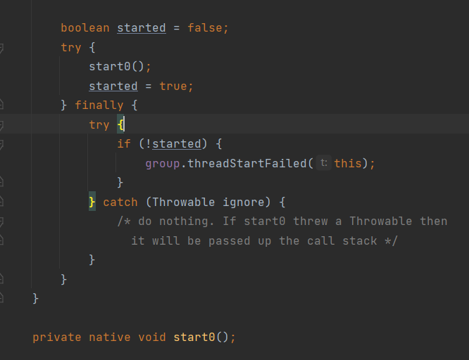
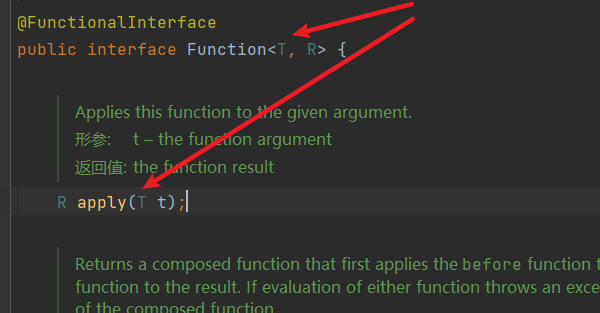
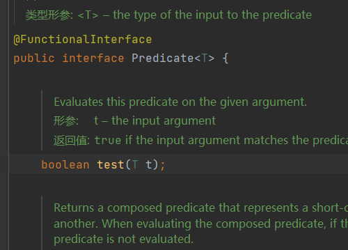
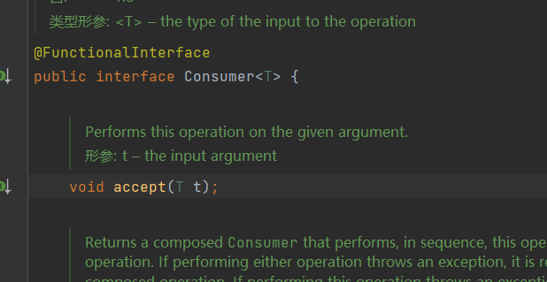
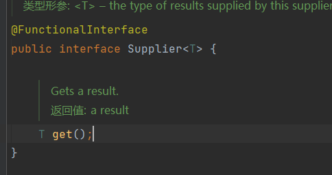

### 什么是JUC?

```
java.util 中的三个包  concurrent   concurrent.atomic concurrent.locks
java.util 工具类 包 分类
```

```
业务 普通的线程代码 Thread
Runnable 没有返回值 相率相比callable低
更多会使用Callable
```

### 线程和进程的关系?

```js
一个进程包含一个或多个线程。
java默认有2个线程  main、GC
java开不了线程  原因如下:
start() 方法调用了 start0() native方法 底层是C++ java无法直接操作硬件
```



### 并发和并行的关系？

```js
并发:多线程操作同一个资源 cpu单核
并行:多个线程同时执行 cpu多核
// 获取CPU的核数
Runtime.getRuntime().availableProcessors()  
```

### 并发编程的本质是什么?

```
充分利用CPU资源
```

### 线程的状态

```java
 public enum State {
     // 新生
     NEW,
     // 运行
     RUNNABLE,
     // 阻塞
     BLOCKED,
     // 等待 死死地等
     WAITING,
     // 超时等待 
     TIMED_WAITING,
     // 终止 
     TERMINATED;
 }
```

### wait和sleep区别

```js
wait 是Object中的方法 会释放锁 必须在同步代码块中 
sleep是Thread中的方法 不会释放锁 可以在任何地方sleep
在企业中一般用 TimeUnit工具类
```

### java多线程如何避免死锁?

```javascript
1.互斥的资源  jdk提供ThreadLocal，把本来互斥的资源变得不互斥，分别给每一个线程这个资源
2.资源不可抢占 
3.持有资源并且不释放
4.相互等待
破环其中之一即可
```

### synchronized锁

```java
import java.util.concurrent.TimeUnit;

public class Test1 {
    public static void main(String[] args) {
        Ticket ticket = new Ticket();
        // 并发: 多线程操作同一个资源类  使用lambda表达式  (参数)->{ 代码 }
        new Thread(()->{
            for (int i = 0;i<40;i++){
                ticket.sale();
            }
        },"A").start();
        new Thread(()->{
            for (int i = 0;i<40;i++){
                ticket.sale();
            }
        },"B").start();
        new Thread(()->{
            for (int i = 0;i<40;i++){
                ticket.sale();
            }
        },"C").start();
    }
}

// 资源类
class Ticket{
    // 属性 方法
    private int number = 50;
    // synchronized 本质 队列，锁  锁的对象是方法的调用者  如果在相应方法上加了static关键字 则锁的对象是class   主要看锁的对象是什么
    public synchronized void sale(){
        if (number > 0){
            System.out.println(Thread.currentThread().getName()+"卖出了第"+(number--)+"张票,剩余:"+number);
        }
    }
}
```

### Lock锁(重点)

```js
公平锁: 必须先来先执行
非公平锁(java默认): 允许插队
```

```java
import java.util.concurrent.locks.Lock;
import java.util.concurrent.locks.ReentrantLock;

public class Test2 {
    public static void main(String[] args) {
        Ticket2 ticket = new Ticket2();
        // 并发: 多线程操作同一个资源类  使用lambda表达式  (参数)->{ 代码 }
        new Thread(()->{
            for (int i = 0;i<40;i++){
                ticket.sale();
            }
        },"A").start();
        new Thread(()->{
            for (int i = 0;i<40;i++){
                ticket.sale();
            }
        },"B").start();
        new Thread(()->{
            for (int i = 0;i<40;i++){
                ticket.sale();
            }
        },"C").start();
    }
}

// 资源类
// lock三部曲
// 1.创建锁   new ReentrantLock();
// 2.lock.lock(); 加锁
// 3.finally-> lock.unlock(); 解锁
class Ticket2{
    // 属性 方法
    private int number = 50;
    Lock lock = new ReentrantLock();
    public void sale(){
        lock.lock();
        try {
            // 业务代码
            if (number > 0){
                System.out.println(Thread.currentThread().getName()+"卖出了第"+(number--)+"张票,剩余:"+number);
            }
        }catch (Exception e){

        }finally {
            lock.unlock();
        }
    }
}
```

### Lock 与  synchronized 的区别

```js
1.synchronized 内置的java关键字 Lock是一个java类
2.synchronized 无法判断锁的状态 Lock可以判断是否获取到锁
3.synchronized 会自动释放锁 Lock必须手动解锁 如果不释放锁会产生死锁
4.synchronized 可重入锁 不可以中断 非公平锁; Lock 可重入锁 可判断锁 默认非公平(在新建对象时传入true则是公平锁)
5.synchronized 适合锁少量的代码同步问题 Lock适合锁大量的代码同步问题
```

### 传统生产者和消费者问题

```java
public class A {
    public static void main(String[] args) {
        Data data = new Data();
        new Thread(()->{
            for (int i = 0;i<10;i++){
                try {
                    data.increment();
                } catch (InterruptedException e) {
                    e.printStackTrace();
                }
            }
        },"A").start();

        new Thread(()->{
            for (int i = 0;i<10;i++){
                try {
                    data.decrement();
                } catch (InterruptedException e) {
                    e.printStackTrace();
                }
            }
        },"B").start();

        new Thread(()->{
            for (int i = 0;i<10;i++){
                try {
                    data.increment();
                } catch (InterruptedException e) {
                    e.printStackTrace();
                }
            }
        },"C").start();

        new Thread(()->{
            for (int i = 0;i<10;i++){
                try {
                    data.decrement();
                } catch (InterruptedException e) {
                    e.printStackTrace();
                }
            }
        },"D").start();
    }
}

// 等待 业务 通知
class Data{
    private int number = 0;
    // +1
    public synchronized void increment() throws InterruptedException {
        while (number != 0){
            // 等待
            this.wait();
        }
        number ++;
        System.out.println(Thread.currentThread().getName()+"=>"+number);
        // 通知其他线程
        this.notifyAll();
    }
    // -1
    public synchronized void decrement() throws InterruptedException {
        while (number == 0){
            this.wait();
        }
        number --;
        System.out.println(Thread.currentThread().getName()+"=>"+number);
        this.notifyAll();
    }
}

```

### JUC版的生产者和消费者的问题

```java
import java.util.concurrent.locks.Condition;
import java.util.concurrent.locks.Lock;
import java.util.concurrent.locks.ReentrantLock;

// condition.await();  condition.signalAll();
public class B {
    public static void main(String[] args) {
        Data2 data = new Data2();
        new Thread(()->{
            for (int i = 0;i<10;i++){
                try {
                    data.increment();
                } catch (InterruptedException e) {
                    e.printStackTrace();
                }
            }
        },"A").start();

        new Thread(()->{
            for (int i = 0;i<10;i++){
                try {
                    data.decrement();
                } catch (InterruptedException e) {
                    e.printStackTrace();
                }
            }
        },"B").start();

        new Thread(()->{
            for (int i = 0;i<10;i++){
                try {
                    data.increment();
                } catch (InterruptedException e) {
                    e.printStackTrace();
                }
            }
        },"C").start();

        new Thread(()->{
            for (int i = 0;i<10;i++){
                try {
                    data.decrement();
                } catch (InterruptedException e) {
                    e.printStackTrace();
                }
            }
        },"D").start();
    }
}

// 等待 业务 通知
class Data2{
    private int number = 0;

    Lock lock = new ReentrantLock();
    Condition condition = lock.newCondition();
    // +1
    public void increment() throws InterruptedException {
        lock.lock();
        try {
            while (number != 0){
                // 等待
                condition.await();
            }
            number ++;
            System.out.println(Thread.currentThread().getName()+"=>"+number);
            // 通知其他线程
            condition.signalAll();
        }catch (Exception e){
            e.printStackTrace();
        }finally {
            lock.unlock();
        }

    }
    // -1
    public void decrement() throws InterruptedException {
        lock.lock();
        try {
            while (number == 0){
                condition.await();
            }
            number --;
            System.out.println(Thread.currentThread().getName()+"=>"+number);
            condition.signalAll();
        }catch (Exception e){
            e.printStackTrace();
        }finally {
            lock.unlock();
        }
    }
}
可保证代码按照一定的顺序执行  new 多个Condition对象监视器即可
```

### 如何判断synchronized 锁的是谁?

```
new this 锁的对象是具体的类对象
static Class 锁的对象是Class
```

### 集合类不安全

#### List

```java
import java.util.*;
import java.util.concurrent.CopyOnWriteArrayList;

//  java.util.ConcurrentModificationException  并发修改异常
public class ListTest {
    public static void main(String[] args) {
        /**
         * 解决方案：
         * 1.使用 Vector<>();
         * 2.使用 CopyOnWriteArrayList<>();
         * 3.使用 Collections.synchronizedList(new ArrayList<>());
         * */
//        List<String> list = new CopyOnWriteArrayList<>();
        List<String> list = Collections.synchronizedList(new ArrayList<>());
        // CopyOnWriteArrayList 使用的是Lock锁  Vector使用的是synchronized
        for (int i = 1;i<=100;i++){
            new Thread(()->{
                list.add(UUID.randomUUID().toString().substring(0,5));
                System.out.println(list);
            },String.valueOf(i)).start();
        }
    }
}
```

#### Set

```java
import java.util.*;
import java.util.concurrent.CopyOnWriteArrayList;
import java.util.concurrent.CopyOnWriteArraySet;

// java.util.ConcurrentModificationException  并发修改异常
public class SetTest {
    public static void main(String[] args) {
//        Set<String> set = new HashSet<>(); // 线程不安全
//        Set<String> set = Collections.synchronizedSet(new HashSet<>()); // 线程安全  使用的是synchronized锁
        Set<String> set = new CopyOnWriteArraySet<>();  // 线程安全  juc方式  使用的是Lock锁 CopyOnWrite 写入时复制 保证效率和性能问题
        for (int i = 1;i<=100;i++){
            new Thread(()->{
                set.add(UUID.randomUUID().toString().substring(0,5));
                System.out.println(set);
            },String.valueOf(i)).start();
        }
    }
}
```

#### HashSet底层

```java
public HashSet() {
	map = new HashMap<>();
}
// add  set本质就是map key是不重复的
public boolean add(E e) {
	return map.put(e, PRESENT)==null;
}
```

#### Map

```java
import java.util.*;
import java.util.concurrent.ConcurrentHashMap;
import java.util.concurrent.CopyOnWriteArraySet;

public class MapTest {
    public static void main(String[] args) {
        // 扩容因子0.75   初始化容量 16
//        Map<String, Object> map = new HashMap<>(); // 线程不安全
        Map<String,Object> map = new ConcurrentHashMap<>(); // 线程安全
//        Map<String,Object> map = Collections.synchronizedMap(new HashMap<>());  // 线程安全 使用的是synchronized锁
        for (int i = 1;i<=100;i++){
            new Thread(()->{
                map.put(Thread.currentThread().getName(),UUID.randomUUID().toString().substring(0,5));
                System.out.println(map);
            },String.valueOf(i)).start();
        }
    }
}
```

### Callable(简单)

```
1.可以有返回值
2.可以抛出异常
3.方法不同 call()
```

```java
import java.util.concurrent.Callable;
import java.util.concurrent.ExecutionException;
import java.util.concurrent.FutureTask;

public class CallableTest {
    public static void main(String[] args) {
        MyThread thread = new MyThread();
        FutureTask futureTask = new FutureTask(thread);  // FutureTask 适配类
        new Thread(futureTask,"A").start();
        new Thread(futureTask,"B").start();  // 结果会被缓存 效率高
        try {
            String result = (String)futureTask.get(); // 获取到Callable的返回结果  可能会产生阻塞把它放在最后
            System.out.println(result);
        } catch (InterruptedException e) {
            e.printStackTrace();
        } catch (ExecutionException e) {
            e.printStackTrace();
        }
    }
}

class MyThread implements Callable<String>{

    @Override
    public String call() throws Exception {
        System.out.println("12312312");
        return "123";
    }
}
```

### JUC常用辅助类(必会)

#### Semaphore(信号量)

```java
import java.util.concurrent.Semaphore;
import java.util.concurrent.TimeUnit;

public class SemaphoreDemo {
    public static void main(String[] args) {
        // 作用 多个共享资源互斥的使用!并发限流 控制最大的线程数
        // 线程数量  停车位
        Semaphore semaphore = new Semaphore(3);
        for (int i = 1;i<=9;i++){
            new Thread(()->{
                // acquire() 得到  假设满了 则等待 等待有资源为止
                try {
                    semaphore.acquire();
                    System.out.println(Thread.currentThread().getName()+"抢到车位");
                    TimeUnit.SECONDS.sleep(2);
                    System.out.println(Thread.currentThread().getName()+"离开车位");
                } catch (InterruptedException e) {
                    e.printStackTrace();
                } finally {
                    semaphore.release(); // release() 释放 会将当前信号量释放 +1 然后唤醒等待的线程
                }

            },String.valueOf(i)).start();
        }

    }
}
```

####  CountDownLatch(减法计数器)

```java
import lombok.SneakyThrows;

import java.util.concurrent.CountDownLatch;

public class CountDownLatchDemo {

    public static void main(String[] args) throws InterruptedException {
        // 总数是6  减法计数器
        CountDownLatch countDownLatch = new CountDownLatch(6);
        for (int i = 1;i<=6;i++){
            new Thread(()->{
                System.out.println(Thread.currentThread().getName()+" Go Out!");
                countDownLatch.countDown();  // -1
            },String.valueOf(i)).start();
        }
        countDownLatch.await(); // 等待计数器归0 然后再向下执行
        System.out.println("Close !!");
    }
}
5 Go Out!
3 Go Out!
1 Go Out!
6 Go Out!
2 Go Out!
4 Go Out!
// 最后关闭 
Close !!
```

#### CyclicBarrier(加法计数器)

```java
import java.util.concurrent.BrokenBarrierException;
import java.util.concurrent.CyclicBarrier;

public class CyclicBarrierDemo {
    public static void main(String[] args) {
        /**
         * 集齐7龙珠召唤神龙
         * */
		// 加法计数器
        CyclicBarrier cyclicBarrier = new CyclicBarrier(7,()->{
            System.out.println("召唤神龙成功！！！");
        });

        for (int i = 1;i<8;i++){
            final int temp = i;
            new Thread(()->{
                System.out.println(Thread.currentThread().getName()+"收集"+temp+"个龙珠");
                try {
                    cyclicBarrier.await();
                } catch (InterruptedException e) {
                    e.printStackTrace();
                } catch (BrokenBarrierException e) {
                    e.printStackTrace();
                }
            }).start();
        }
    }
}
Thread-3收集4个龙珠
Thread-4收集5个龙珠
Thread-5收集6个龙珠
Thread-0收集1个龙珠
Thread-1收集2个龙珠
Thread-2收集3个龙珠
Thread-6收集7个龙珠
召唤神龙成功！！！
```

### 读写锁

```java
import java.util.HashMap;
import java.util.Map;
import java.util.concurrent.locks.Lock;
import java.util.concurrent.locks.ReadWriteLock;
import java.util.concurrent.locks.ReentrantLock;
import java.util.concurrent.locks.ReentrantReadWriteLock;

/**
 * 独占锁(写锁) 一次只能被一个线程访问
 * 共享锁(读锁) 多线程可以同时占有
 * ReadWriteLock
 * 读-读 可以共存
 * 写-写 不能共存
 * 写-读 不能共存
 * */
public class ReadWriteLockDemo {
    public static void main(String[] args) {
        MyCacheLock myCache = new MyCacheLock();
        // 写入
        for (int i = 1;i<=5;i++){
            final int tem = i;
            new Thread(()->{
                myCache.put(tem+"",tem+"");
            },String.valueOf(i)).start();
        }

        // 读取
        for (int i = 1;i<=5;i++){
            final int tem = i;
            new Thread(()->{
                myCache.get(tem+"");
            },String.valueOf(i)).start();
        }
    }
}

/**
 * 自定义缓存   先写完 写入ok后才读取
 * */
class MyCacheLock{
    private volatile Map<String,Object> map= new HashMap<>();
    // 读写锁  更加细粒度的控制
    private ReadWriteLock readWriteLock =  new ReentrantReadWriteLock();
    // 存 写  只希望一个线程去写
    public void put(String k,Object v){
        readWriteLock.writeLock().lock();
        try {
            System.out.println(Thread.currentThread().getName()+"写入"+k);
            map.put(k,v);
            System.out.println(Thread.currentThread().getName()+"写入OK");
        }catch (Exception e){
            e.printStackTrace();
        }finally {
            readWriteLock.writeLock().unlock();
        }
    }
    //取 读 可多线程读
    public void get(String k){
        readWriteLock.readLock().lock();
        try {
            System.out.println(Thread.currentThread().getName()+"读取"+k);
            Object o = map.get(k);
            System.out.println(Thread.currentThread().getName()+"读取OK");
        }catch (Exception e){
            e.printStackTrace();
        }finally {
            readWriteLock.readLock().unlock();
        }

    }
}

/**
 * 自定义缓存  这个在写入的时候可能会被插队  
 * */
class MyCache{
    private volatile Map<String,Object> map= new HashMap<>();
    // 存 写
    public void put(String k,Object v){
        System.out.println(Thread.currentThread().getName()+"写入"+k);
        map.put(k,v);
        System.out.println(Thread.currentThread().getName()+"写入OK");
    }
    //取 读
    public void get(String k){
        System.out.println(Thread.currentThread().getName()+"读取"+k);
        Object o = map.get(k);
        System.out.println(Thread.currentThread().getName()+"读取OK");
    }
}
3写入3
3写入OK
4写入4
4写入OK
2写入2
2写入OK
1写入1
1写入OK
5写入5
5写入OK
3读取3
5读取5
2读取2
3读取OK
1读取1
5读取OK
4读取4
2读取OK
4读取OK
1读取OK
```

### 阻塞队列

```java
import java.util.concurrent.ArrayBlockingQueue;
import java.util.concurrent.BlockingQueue;
import java.util.concurrent.TimeUnit;

public class Bqdemo {
    public static void main(String[] args) throws InterruptedException {
//        BlockingQueue<E> 不是新东西
        /**
         *  应用场景: 线程池 ，多线程并发处理
         *  使用: 1.抛出异常  2.不抛出异常 3.阻塞等待 4.超时等待
         * */
        test4();
    }
    // 抛出异常
    public static void test1 () {
        ArrayBlockingQueue arrayBlockingQueue = new ArrayBlockingQueue(3);
        System.out.println(arrayBlockingQueue.add("a"));
        System.out.println(arrayBlockingQueue.add("b"));
        System.out.println(arrayBlockingQueue.add("c"));
        // IllegalStateException: Queue full 抛出异常
//        System.out.println(arrayBlockingQueue.add("D"));
        System.out.println(arrayBlockingQueue.element()); // a  获取队首元素
        System.out.println(arrayBlockingQueue.remove());
        System.out.println(arrayBlockingQueue.remove());
        System.out.println(arrayBlockingQueue.remove());
        // NoSuchElementException 抛出异常
//        System.out.println(arrayBlockingQueue.remove());

    }
    // 不抛出异常  有返回值
    public static void test2 () {
        ArrayBlockingQueue arrayBlockingQueue = new ArrayBlockingQueue(3);
        System.out.println(arrayBlockingQueue.offer("a"));
        System.out.println(arrayBlockingQueue.offer("b"));
        System.out.println(arrayBlockingQueue.offer("c"));
        // false 不抛出异常
//        System.out.println(arrayBlockingQueue.offer("d"));
//        System.out.println(arrayBlockingQueue.peek());  // a  获取队首元素
        System.out.println(arrayBlockingQueue.poll());
        System.out.println(arrayBlockingQueue.poll());
        System.out.println(arrayBlockingQueue.poll());
        // null 不抛出异常
        System.out.println(arrayBlockingQueue.poll());
    }
    // 阻塞等待 (一直)
    public static void test3() throws InterruptedException {
        ArrayBlockingQueue arrayBlockingQueue = new ArrayBlockingQueue(3);
        // 一直阻塞
        arrayBlockingQueue.put("a");
        arrayBlockingQueue.put("b");
        arrayBlockingQueue.put("c");
        // 一直阻塞(等待)
//        arrayBlockingQueue.put("d");
        System.out.println(arrayBlockingQueue.take());
        System.out.println(arrayBlockingQueue.take());
        System.out.println(arrayBlockingQueue.take());
        // 一直阻塞(等待)
//        System.out.println(arrayBlockingQueue.take());

    }

    // 阻塞等待 (限时)  重点 
    public static void test4() throws InterruptedException {
        ArrayBlockingQueue arrayBlockingQueue = new ArrayBlockingQueue(3);
        arrayBlockingQueue.offer("a");
        arrayBlockingQueue.offer("b");
        arrayBlockingQueue.offer("c");
        // 等2s 如果进不去 2s后就退出
        arrayBlockingQueue.offer("d",2, TimeUnit.SECONDS);
        System.out.println("=================");
        System.out.println(arrayBlockingQueue.poll());
        System.out.println(arrayBlockingQueue.poll());
        System.out.println(arrayBlockingQueue.poll());
        // 等2s 如果取不到 2s后就退出
        arrayBlockingQueue.poll(2,TimeUnit.SECONDS);
    }
}
```

### 同步队列

```java
import java.util.concurrent.BlockingQueue;
import java.util.concurrent.SynchronousQueue;
import java.util.concurrent.TimeUnit;

public class Sqdemo {
    public static void main(String[] args) {
        /**
         * 同步队列 没有容量 进入一个后必须出来才能进入
         * SynchronousQueue 不存储元素
         * put了一个元素 必须从里面先take取出来 否则不能再put值进去
         * */
        BlockingQueue<String> synchronousQueue = new SynchronousQueue<>();
        new Thread(()->{
            try {
                System.out.println(Thread.currentThread().getName()+" put 1");
                synchronousQueue.put("1");
                System.out.println(Thread.currentThread().getName()+" put 2");
                synchronousQueue.put("2");
                System.out.println(Thread.currentThread().getName()+" put 3");
                synchronousQueue.put("3");
            } catch (InterruptedException e) {
                e.printStackTrace();
            }
        },"A").start();

        new Thread(()->{
            try {
                TimeUnit.SECONDS.sleep(1);
                System.out.println(Thread.currentThread().getName()+"=>"+synchronousQueue.take());
                TimeUnit.SECONDS.sleep(1);
                System.out.println(Thread.currentThread().getName()+"=>"+synchronousQueue.take());
                TimeUnit.SECONDS.sleep(1);
                System.out.println(Thread.currentThread().getName()+"=>"+synchronousQueue.take());
            } catch (Exception e) {
                e.printStackTrace();
            }
        },"B").start();
    }
}
```

### 线程池(重点)

```java
 线程池 jdbc连接池 对象池.....
池化技术: 事先准备好一些资源，要用直接拿，用完还回来
```

#### 线程池的好处

```js
线程复用 控制最大并发数 管理线程
```

#### 线程池种类

```java
// 底层都调用 ThreadPoolExecutor 

Executors.newFixedThreadPool(5); // 固定容量线程池
public static ExecutorService newFixedThreadPool(int nThreads) {
        return new ThreadPoolExecutor(nThreads, nThreads,
                                      0L, TimeUnit.MILLISECONDS,
                                      new LinkedBlockingQueue<Runnable>());
    }

Executors.newSingleThreadExecutor();  // 单线程线程池
public static ExecutorService newSingleThreadExecutor() {
        return new FinalizableDelegatedExecutorService
            (new ThreadPoolExecutor(1, 1,
                                    0L, TimeUnit.MILLISECONDS,
                                    new LinkedBlockingQueue<Runnable>()));
    }
单线程线程池 和 固定容量线程池:允许请求的队列长度为 Integer.MAX_VALUE 可能会堆积大量请求 导致OOM
    
Executors.newScheduledThreadPool(); // 创建一个定长线程池，支持定时及周期性任务执行。
Executors.newCachedThreadPool(); // 可缓存线程池
public static ExecutorService newCachedThreadPool() {
        return new ThreadPoolExecutor(0, Integer.MAX_VALUE,
                                      60L, TimeUnit.SECONDS,
                                      new SynchronousQueue<Runnable>());
    }
可缓存线程池 和 周期性线程池 允许创建的线程数量为 Integer.MAX_VALUE 可能会创建大量线程从而导致OOM
这些内置的方法可能会导致OOM  一般使用自定义线程池
```

####  ThreadPoolExecutor 类详解

可参考 https://blog.csdn.net/weixin_38898423/article/details/123724964

```java
public ThreadPoolExecutor(int corePoolSize, // 核心线程池大小
                              int maximumPoolSize, // 最大线程池数量
                              long keepAliveTime, // 超时没被调用就释放
                              TimeUnit unit, // 超时单位
                              BlockingQueue<Runnable> workQueue, // 阻塞队列
                              ThreadFactory threadFactory, // 线程工厂 创建线程的 一般不动
                              RejectedExecutionHandler handler // 拒绝策略
                         ) {
        if (corePoolSize < 0 ||
            maximumPoolSize <= 0 ||
            maximumPoolSize < corePoolSize ||
            keepAliveTime < 0)
            throw new IllegalArgumentException();
        if (workQueue == null || threadFactory == null || handler == null)
            throw new NullPointerException();
        this.corePoolSize = corePoolSize;
        this.maximumPoolSize = maximumPoolSize;
        this.workQueue = workQueue;
        this.keepAliveTime = unit.toNanos(keepAliveTime);
        this.threadFactory = threadFactory;
        this.handler = handler;
    }

corePoolSize：核心池的大小，这个参数跟后面讲述的线程池的实现原理有非常大的关系。在创建了线程池后，默认情况下，线程池中并没有任何线程，而是等待有任务到来才创建线程去执行任务，除非调用了prestartAllCoreThreads()或者prestartCoreThread()方法，从这2个方法的名字就可以看出，是预创建线程的意思，即在没有任务到来之前就创建corePoolSize个线程或者一个线程。默认情况下，在创建了线程池后，线程池中的线程数为0，当有任务来之后，就会创建一个线程去执行任务，当线程池中的线程数目达到corePoolSize后，就会把到达的任务放到阻塞队列当中；

maximumPoolSize：线程池最大线程数，这个参数也是一个非常重要的参数，它表示在线程池中最多能创建多少个线程；
最大的线程数量如何设置?
CPU密集型: 最大线程数定义为cpu的最大核心数 充分利用cpu资源 保证cpu效率最高 Runtime.getRuntime().availableProcessors()  // 获取运行机器的cpu最大核数
IO密集型:  判断程序中十分占内存的线程 一般是双倍 io十分占资源

keepAliveTime：表示线程没有任务执行时最多保持多久时间会终止。默认情况下，只有当线程池中的线程数大于corePoolSize时，keepAliveTime才会起作用，直到线程池中的线程数不大于corePoolSize，即当线程池中的线程数大于corePoolSize时，如果一个线程空闲的时间达到keepAliveTime，则会终止，直到线程池中的线程数不超过corePoolSize。但是如果调用了allowCoreThreadTimeOut(boolean)方法，在线程池中的线程数不大于corePoolSize时，keepAliveTime参数也会起作用，直到线程池中的线程数为0;

unit：参数keepAliveTime的时间单位 一般使用TimeUnit

workQueue：一个阻塞队列，用来存储等待执行的任务，这个参数的选择也很重要，会对线程池的运行过程产生重大影响，一般来说，这里的阻塞队列有以下几种选择：
    ArrayBlockingQueue;
    LinkedBlockingQueue;
    SynchronousQueue;

threadFactory：线程工厂，主要用来创建线程；

handler：表示当拒绝处理任务时的策略，有以下四种取值：
    ThreadPoolExecutor.AbortPolicy:丢弃任务并抛出RejectedExecutionException异常。
    ThreadPoolExecutor.DiscardPolicy：也是丢弃任务，但是不抛出异常。
    ThreadPoolExecutor.DiscardOldestPolicy：丢弃队列最前面的任务，然后重新尝试执行任务（重复此过程） 不抛出异常
    ThreadPoolExecutor.CallerRunsPolicy：由调用线程处理该任务
eg:
ThreadPoolExecutor threadPoolExecutor = new ThreadPoolExecutor(
    // 核心数
    5,
    10,
    1,
    TimeUnit.HOURS, 
    new LinkedBlockingQueue<>(),
    r -> {
        return null;
    },
    (r, executor) -> {

    }
);
```

#### 线程池的执行流程

```java
当任务提交给ThreadPoolExecutor线程池中，先检查核心线程数是否已经全部使用，如果没有，则交由核心线程去执行任务，如果核心线程数已经全部占用，则将任务添加到队列里面，如果队列已经占满，比较当前线程池中的线程的数量是不是已超过maximumPoolSize，如果没有超过则创建线程去执行，也就是说线程池最多可以接受多少任务呢？就是maximumPoolSize+队列的大小。当线程池中的线程的数量大于corePoolSize数量时，有空闲线程则执行回收，回收时间是keepAliveTime，单位是unit，都是初始化的时候设置的。
```

### 四大函数式接口(必须掌握)

```java
泛型 枚举 反射
1.lambda 表达式
2.链式编程
3.函数式接口  简化编程
4.Stream流计算
```

```
函数式接口:只有一个方法的接口
例如 Runnable Callable

@FunctionalInterface
public interface Runnable {
    /**
     * When an object implementing interface {@code Runnable} is used
     * to create a thread, starting the thread causes the object's
     * {@code run} method to be called in that separately executing
     * thread.
     * <p>
     * The general contract of the method {@code run} is that it may
     * take any action whatsoever.
     *
     * @see     java.lang.Thread#run()
     */
    public abstract void run();
}
```

#### Function 函数型接口



```java
// T 为参数类型 R为返回类型 
Function<String, String> function = (str)->{return str;};
 System.out.println(function.apply("123")); // 123
```

#### Predicate 断定型接口



```
Predicate<String> predicate = (str)->{return str.isEmpty();};
System.out.println(predicate.test(""));  // true
```

#### Consumer 消费型接口



```java
Consumer<String> consumer = (str)->{
    System.out.println(str);
};
consumer.accept("123");  // 123
```

#### Supplier 供给型接口



```java
Supplier<String> supplier = ()->{return "1234";};
System.out.println(supplier.get());  // 1234
```

### Stream流式计算

```java
/**
 * 1.ID 为偶数
 * 2.年龄大于 23岁
 * 3.用户名转为大写
 * 4.用户名字母倒序
 * 5.只输出一个用户
 * */
User u1 = new User(1,12,"a");
        User u2 = new User(2,12,"b");
        User u3 = new User(3,42,"c");
        User u4 = new User(4,25,"d");
        User u5 = new User(6,25,"e");
        List<User> list = Arrays.asList(u1,u3,u2,u4,u5);
        list.stream()
                .filter(u->{return u.getId()%2==0;})
                .filter(u->{return u.getAge()>23;})
                .map(u->{return u.getName().toUpperCase();})
                .sorted(Comparator.reverseOrder())
                .limit(1)
                .forEach(System.out::println);
```

