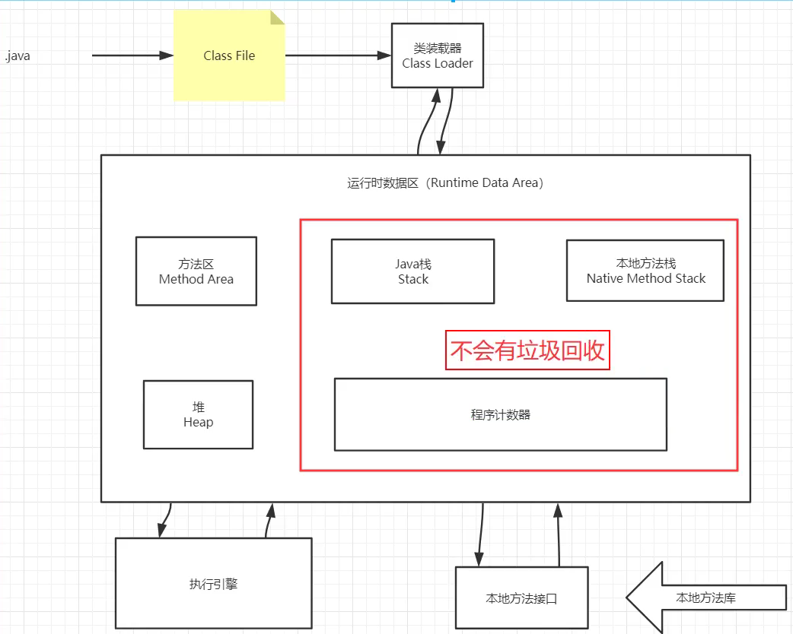

## JRE、JDK、JVM 及 JIT 之间有什么不同？

```
JRE 代表 Java 运行时（Java run-time），是运行 Java 引用所必须的。
JDK 代表 Java 开发工具（Java development kit），是 Java 程序的开发工具，如 Java编译器，它也包含 JRE。
JVM 代表 Java 虚拟机（Java virtual machine），它的责任是运行 Java 应用。
JIT 代表即时编译（Just In Time compilation），当代码执行的次数超过一定的阈值时，会将 Java 字节码转换为本地代码，如，主要的热点代码会被准换为本地代码，这样有利大幅度提高 Java 应用的性能。
JRE = JVM + Java核心类库
JDK = JRE + Java开发工具
```

### jvm体系结构

```javascript
java --> class File --> 类装载器  如下图
所谓jvm调优 99%都是在堆和方法区中调优
```



```javascript
1.程序计数器:当前线程所执行的字节码的型号指示器
2.栈:描述java方法执行的内存模型，用于存储局部变量表等信息
3.本地方法区:为native方法服务
4.堆:保存了创建的对象和数组，是频繁进行轻GC的内存区域，使用分代收集算法，故可细分为新生代和老年代
5.方法区(永久代):用于存储常量、静态变量、class信息等数据
```

#### 类加载器

```javascript
作用: 加载class文件
jvm提供了三层classLoader:
    1.Bootstrap classLoader:主要负责加载核心的类库(java.lang.*等)，构造ExtClassLoader和APPClassLoader。
    2.ExtClassLoader：主要负责加载jre/lib/ext目录下的一些扩展的jar。
    3.AppClassLoader：主要负责加载应用程序的主函数类
类加载器加载流程(双亲委派机制  app-->ext-->boot(最终执行)):
	1.类加载器收到类加载的请求
	2.将这个请求委托给父加载器，直到boot类加载器
	3.boot类加载器检查是否能加载此类，能加载就结束;否则,抛出异常并通知子加载器加载
	4.重复第三步直到app类加载器
```

#### 双亲委派机制

```javascript
作用: 因为最先加载的是bootstrapClassLoader，
故其他类加载器并没有机会去加载，从一定程度上防止了危险代码的植入，保证了jvm的安全。
```

### Native关键字

```javascript
凡是带了native关键字的，说明超出了java的作用范围，回去调底层c语言的库
会进入本地方法栈 调用本地方法接口 JNI
JNI作用:扩展java的使用，融合不同的编程语言为java所用。(c、c++)
```

### 堆分区

```javascript
分为两个区: 新生区 老年区
1.新生区:
主要是用来存放新生的对象。由于频繁创建对象，所以新生代会频繁进行轻GC
2.老年区:
老年代的对象比较稳定，所以轻GC不会频繁执行。
```

### GC 是什么？为什么要有 GC？

```
GC 是垃圾回收的意思 。
作用:垃圾回收可以有效的防止内存泄露，有效的使用可以使用的内存。
```

### GC的分类

```javascript
轻GC(普通GC) 和 重GC(全局GC)
区别:
轻GC主要收集新生区而重GC是对整个堆和方法区进行垃圾回收
```

### GC的算法有哪些?

```
复制算法 
标记清除法 
标记整理法  
引用计数器
```

### 你能保证 GC 执行吗？

```
不能，虽然你可以调用 System.gc() 或者 Runtime.gc()，但是没有办法保证 GC的执行。
```

## 堆和栈的区别

```javascript
1. 功能不同
栈内存用来存储局部变量和方法调用，而堆内存用来存储Java中的对象。
2. 共享性不同
栈内存是线程私有的。
堆内存是所有线程共有的。
3. 空间大小
栈的空间大小远远小于堆的
```

## 什么是Java虚拟机？

```
Java虚拟机是一个可以执行Java字节码的虚拟机进程。即jvm
```

## Java对象创建过程

```javascript
1. jvm找到并且加载这个类 
2. 为对象分配内存并且初始化为0。
3. 对对象头进行必要设置
```

## 你知道哪些JVM性能调优参数

```javascript
设定堆存大小
-Xmx：堆内存最大限制。
设定新生代大小。 新生代不宜太小，否则会有大量对象涌入老年代
-XX:NewSize：新生代大小
-XX:NewRatio 新生代和老生代占比
-XX:SurvivorRatio：伊甸园空间和幸存者空间的占比
设定垃圾回收器 年轻代用 -XX:+UseParNewGC 年老代用-XX:+UseConcMarkSweepGC
```

转自  https://www.cnblogs.com/chengxuyuanxiaoyang/p/13692997.html
